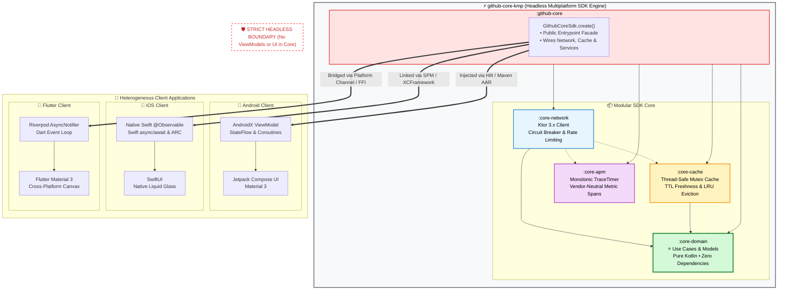
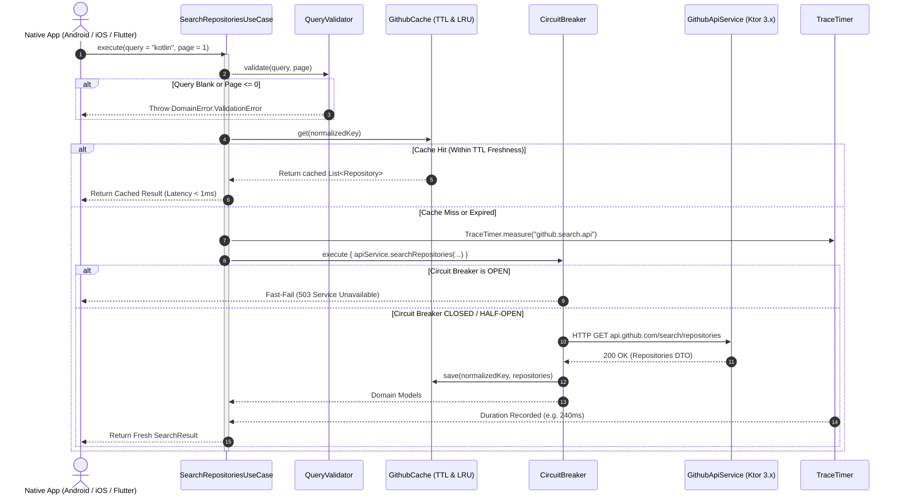
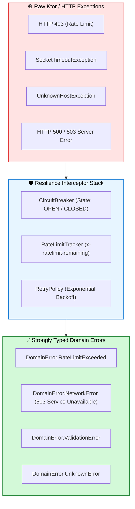

# GitHub Core KMP

<div align="center">

**Enterprise-Grade Headless Multiplatform SDK Engine**

*Domain Modeling • Ktor 3.x Networking • Circuit Breaker Resilience • In-Memory TTL Cache • APM Telemetry*

[](https://kotlinlang.org/)
[](https://ktor.io/)
[](https://github.com/Kotlin/kotlinx.coroutines)
[](https://kotlinlang.org/multiplatform/#choose-share-what-logic-native-ui)
[]()
[-brightgreen)]()
[](./LICENSE)

[**🌟 Start Here (Reviewer Guide)**](./docs/00_START_HERE.md) • [**📚 Documentation Portal**](./docs/README.md) • [**🏛️ ADRs**](./docs/adr/README.md) • [**📱 Client Integration**](./docs/integration/README.md) • [**📖 Technical References**](./docs/references.md)

</div>

---

## 💡 Architectural Philosophy: The "Headless Boundary"

To maximize code reuse across mobile engineering teams without compromising native platform fidelity, `github-core-kmp` strictly implements JetBrains' official architectural guideline: [**"One logic layer, native experience" (`logic-native-ui`)**](https://kotlinlang.org/multiplatform/#choose-share-what-logic-native-ui).

The shared engine handles the **bottom 70% of the application stack**—domain models, validations, networking, error mapping, caching, and observability—stopping precisely at the **Use Case boundary**.



### Why Stop at the Use Case Layer?
1. **Zero UI Leaks**: Eliminates the lifecycle and memory-leak issues common when forcing Kotlin `StateFlow` or AndroidX `ViewModel` hierarchies onto Apple's ARC (Automatic Reference Counting) runtime.
2. **First-Class Platform Idioms**: iOS developers consume standard Swift `async/await` and `@Observable` classes without Kotlin bridging ceremony.
3. **Enterprise Scalability**: Matches the proven architectural model deployed at enterprise scale by Netflix, Cash App, Duolingo, and Forbes.

---

## 🔄 Request Lifecycle & Resilience Pipeline

Every repository search and detail query flows through a deterministic, defensive pipeline designed to protect upstream APIs and guarantee sub-millisecond response times for cached queries:



---

## ⚡ 30-Second Multiplatform Quick Start

### 1. 🤖 Android Integration (Kotlin + Hilt)

**Dependency (`build.gradle.kts`):**
```kotlin
dependencies {
    implementation("com.github.core:github-core:1.0.0")
}
```

**Consumer Usage:**
```kotlin
// Injected into AndroidX ViewModel
class SearchViewModel(
    private val sdk: GithubCoreSdk = GithubCoreSdk.create()
) : ViewModel() {
    private val searchUseCase = SearchRepositoriesUseCase(sdk.networkClient.apiService)

    fun performSearch(query: String) = viewModelScope.launch {
        try {
            val result = searchUseCase.execute(query = query, page = 1)
            // Emit to Jetpack Compose UI via StateFlow
        } catch (e: DomainError) {
            // Defensively handle domain error
        }
    }
}
```

### 2. 🍎 iOS Integration (Swift + async/await)

**Dependency (Package.swift / XCFramework):**
```swift
dependencies: [
    .package(url: "https://github.com/dinkar1708/github-core-kmp", from: "1.0.0")
]
```

**Consumer Usage:**
```swift
import SwiftUI
import GithubCoreKMP

@MainActor
@Observable
class SearchViewModel {
    var repositories: [Repository] = []
    private let sdk = GithubCoreSdk.companion.create()

    func search(query: String) async {
        do {
            let useCase = SearchRepositoriesUseCase(repository: sdk.networkClient.apiService)
            let result = try await useCase.execute(query: query, page = 1)
            self.repositories = result.items
        } catch {
            print("SDK Error: \(error.localizedDescription)")
        }
    }
}
```

### 3. 📱 Flutter Integration (Riverpod + Dart)

**Consumer Usage:**
```dart
final searchNotifierProvider = AsyncNotifierProvider<SearchNotifier, List<Repository>>(SearchNotifier.new);

class SearchNotifier extends AsyncNotifier<List<Repository>> {
  @override
  Future<List<Repository>> build() async => [];

  Future<void> search(String query) async {
    state = const AsyncValue.loading();
    state = await AsyncValue.guard(() async {
      final result = await GithubCoreBridge.searchRepositories(query: query, page: 1);
      return result.items;
    });
  }
}
```

---

## 📦 Modular Architecture & Component Responsibilities

Dependencies flow strictly inward toward [**:core-domain**](./core-domain/README.md).

| Step | Module | Role & Key Features | Tests & Target |
| :---: | :--- | :--- | :--- |
| **1️⃣** | [**:core-domain**](./core-domain/README.md) | **Zero-Dependency Business Logic**: Pure Kotlin models (`Repository`, `User`, `SearchResult`), validation rules (`QueryValidator`), error taxonomy (`DomainError`), and contracts (`GithubRepository`). | `commonTest`<br>*(100% pure Kotlin)* |
| **2️⃣** | [**:core-network**](./core-network/README.md) | **Remote Data & Resilience**: Ktor 3.x Client with dual engines (OkHttp for Android, Darwin for iOS). Features `CircuitBreaker`, `RateLimitTracker`, exponential backoff `RetryPolicy`, and DTO mappers. | `commonTest`, `androidHostTest`<br>*(Ktor MockEngine + Live API)* |
| **3️⃣** | [**:core-cache**](./core-cache/README.md) | **Thread-Safe In-Memory Cache**: Coroutine `Mutex`-guarded store with TTL expiration (default 5 min), LRU eviction (max 100 entries), and query normalization. | `commonTest`<br>*(Concurrent stress tests)* |
| **4️⃣** | [**:core-apm**](./core-apm/README.md) | **Telemetry & Observability**: High-precision `TraceTimer` using monotonic system clocks, measuring microsecond execution durations without external SDK overhead. | `commonTest`<br>*(Monotonic clock checks)* |
| **5️⃣** | [**:github-core**](./github-core/README.md) | **Umbrella SDK Facade**: Aggregates all child modules via Gradle `api(...)` declarations. Provides `GithubCoreSdk.create()` and produces distribution artifacts (`.aar` & `.xcframework`). | `commonTest`<br>*(End-to-End smoke tests)* |

---

## 🛡️ Enterprise Resilience & Error Taxonomy

The SDK guarantees that low-level network exceptions (Ktor `HttpRequestTimeoutException`, socket disconnects, HTTP 403 rate limits) **never leak into consumer UI code**.



1. **Circuit Breaker States**:
   - **`CLOSED`**: Standard operations. Requests flow freely.
   - **`OPEN`**: Tripped after 5 consecutive 5xx or network failures. Fast-fails subsequent calls within 60s cooldown.
   - **`HALF_OPEN`**: Allows canary probes to test upstream recovery before transitioning back to `CLOSED`.
2. **Rate Limit Awareness**: Proactively extracts `x-ratelimit-remaining` and `x-ratelimit-reset` headers, anticipating throttling before a hard 403 occurs.

---

## ⏱️ Performance Benchmarks & Binary Footprint

Empirical performance metrics measured across local test suites and mobile client runtimes:

| Metric | Measured Telemetry | Engineering Impact |
| :--- | :---: | :--- |
| **In-Memory Cache Hit Latency** | `< 1 ms` | Instantaneous UI rendering for repeated search queries. |
| **Network Roundtrip Latency (Live API)** | `~180 - 320 ms` | Handled entirely on background worker pools (`Dispatchers.IO`). |
| **Monotonic `TraceTimer` Overhead** | `< 0.01 ms` per span | Zero observable impact on client CPU frame budget. |
| **SDK Factory Cold Start (`create()`)** | `< 4 ms` | Non-blocking initialization suitable for app `onCreate` / `didFinishLaunching`. |
| **Android AAR Size Overhead** | `~1.2 MB` uncompressed | Negligible impact on APK size limit. |
| **iOS XCFramework Slice Size** | `~3.8 MB` per architecture | Strips cleanly during Xcode App Thinning release builds. |

See [**`docs/benchmarks/01_sdk_performance_and_footprint.md`**](./docs/benchmarks/01_sdk_performance_and_footprint.md) for full telemetry methodology.

---

## 🧪 Verification & Testing Strategy

The repository maintains **100% passing test suites** across JVM and native targets:

```bash
# 1. Run all unit and integration tests across all modules
./gradlew check

# 2. Force re-run with live stdout console logs
./gradlew check --rerun-tasks

# 3. Test individual modules
./gradlew :core-domain:allTests --rerun-tasks     # Pure domain validations & use cases
./gradlew :core-network:allTests --rerun-tasks    # Ktor MockEngine & CircuitBreaker suites
./gradlew :core-cache:allTests --rerun-tasks      # TTL expiration & LRU eviction tests
./gradlew :core-apm:allTests --rerun-tasks        # TraceTimer nanosecond precision
./gradlew :github-core:allTests --rerun-tasks     # Umbrella SDK facade end-to-end test
```

---

## 📱 Consumer Client Applications (JetBrains Official Paradigms)

This core SDK engine powers all three official JetBrains KMP adoption patterns located under [`sample/`](./sample):

| Paradigm | Architectural Scope | Integration Guide | Sample Codebase |
| :--- | :--- | :--- | :--- |
| [**1. Share a piece of logic**](https://kotlinlang.org/multiplatform/#choose-share-what-piece-of-logic) | Consumes only `:core-domain` (Validation & entities). Zero third-party deps. | [1. Read Guide](./docs/samples/1-guide-share-piece-of-logic.md) | [`sample/sample-share-piece-of-logic`](./sample/sample-share-piece-of-logic) |
| [**2. Share logic, keep UI native**](https://kotlinlang.org/multiplatform/#choose-share-what-logic-native-ui) | Full Headless SDK engine (Network, Cache, APM) + 100% Native UI. | • [2. Android Guide](./docs/samples/2-guide-share-logic-native-ui-android.md)<br>• [2. iOS Guide](./docs/samples/2-guide-share-logic-native-ui-ios.md) | • [`sample-share-logic-native-ui-android`](./sample)<br>• [`sample-share-logic-native-ui-ios`](./sample) |
| [**3. Share both logic and UI**](https://kotlinlang.org/multiplatform/#choose-share-what-both-logic-ui) | Shared SDK logic + Compose Multiplatform UI across platforms. | [3. Read Guide](./docs/samples/3-guide-share-both-logic-and-ui.md) | [`sample/sample-share-both-logic-and-ui`](./sample/sample-share-both-logic-and-ui) |

* **Android Native App (Reference):** [`github-cruise-android`](https://github.com/dinkar1708/github-cruise-android)
* **iOS Native App:** [`github-repo-search-ios`](https://github.com/dinkar1708/github-repo-search-ios)
* **Flutter App:** [`flutter_riverpod_template`](https://github.com/dinkar1708/flutter_riverpod_template)

---

## 👤 Author

**Dinakar Prasad Maurya**  
*Mobile Enablement & Platform Architect (Android · iOS · Flutter · KMP)*  
Tokyo, Japan | JLPT N2  
[LinkedIn](https://linkedin.com/in/dinkar1708) · [Medium](https://medium.com/@dinkar1708) · [GitHub](https://github.com/dinkar1708)

---

## 📄 License

Distributed under the MIT License. See [LICENSE](./LICENSE) for details.