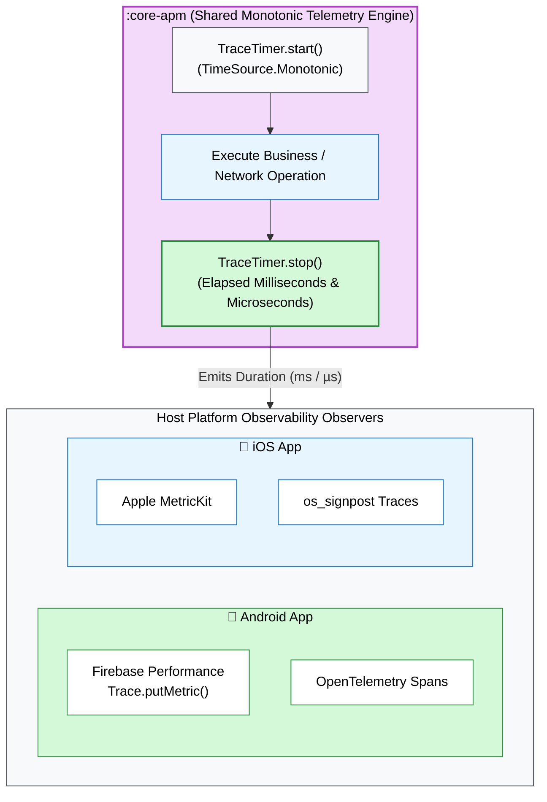

# 📊 `:core-apm`

> 📖 **Official Standards & References:**  
> • [Kotlin Standard Library: TimeSource.Monotonic](https://kotlinlang.org/api/latest/jvm/stdlib/kotlin.time/-time-source/-monotonic/)  
> • [OpenTelemetry: Distributed Tracing & Span Specification](https://opentelemetry.io/docs/specs/otel/trace/api/#span)  
> • [W3C: High Resolution Time Level 2 Recommendation](https://www.w3.org/TR/hr-time-2/)

Application Performance Monitoring (APM) and execution telemetry engine.

---

## 💡 Core Concept & Architectural Role

* **Execution Latency Observability:** Accurately measures operation durations for network queries, cache lookups, and Use Case processing.
* **Vendor-Agnostic Design:** Does not package vendor-specific SDKs (Firebase/Datadog) into the shared KMP binary, preventing binary bloat and version conflicts.
* **Zero Overhead:** Employs allocation-free, non-blocking timers executing in $\mathcal{O}(1)$ time with negligible CPU footprint.

---

## 📦 Import & Dependencies

### Gradle
```kotlin
dependencies {
    // Consumer applications import the umbrella SDK:
    implementation("com.github.core:github-core")
    // Or internal module dependency:
    implementation(project(":core-apm"))
}
```

### Key Kotlin Imports
```kotlin
import com.github.core.apm.TraceTimer
```

---

## 🔑 Key Definitions: `TraceTimer`

`TraceTimer` (`com.github.core.apm`) tracks operation latency across platforms:

| Property / Method | Definition & Role |
| :--- | :--- |
| `val name: String` | Span identifier (e.g. `"github_search_request"`). |
| `fun start()` | Captures starting monotonic timestamp. |
| `fun stop(): Long` | Captures terminal timestamp, computes $\Delta t = t_{\text{end}} - t_{\text{start}}$, and returns duration in milliseconds. |

---

## 🔬 Internal Mechanics & Platform Bridging



### Host Platform Bridging
Host applications catch durations emitted by `TraceTimer.stop()` and forward them to native APM tools:
* **Android:** Bridges into `Firebase.performance.newTrace(timer.name).putMetric(...)`.
* **iOS:** Bridges into Apple `os_signpost` or MetricKit payloads.

---

## 💻 Usage Pattern

```kotlin
// 1. Start execution timer
val timer = TraceTimer("repo_search_span")
timer.start()

// 2. Perform operation
val result = searchUseCase.execute("kotlin")

// 3. Stop timer and forward duration
val elapsedMs = timer.stop()
println("Search operation completed in ${elapsedMs}ms")
```

---

## 🧪 Verification

```bash
# Run multiplatform APM unit tests
./gradlew :core-apm:allTests --rerun-tasks
```
