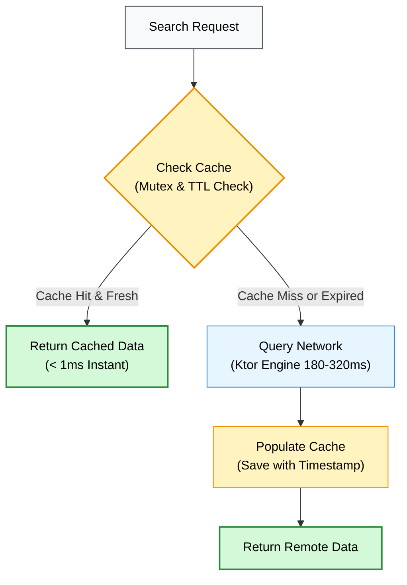

# 💾 `:core-cache`

Offline-first caching and local persistence engine for the GitHub Core KMP SDK.

---

## 💡 Core Concept & Architectural Role

* **Cold-Start Acceleration:** Delivers instant UI rendering (0ms initial latency) from local storage while fresh network data syncs in the background.
* **Offline Usability:** Preserves search queries and repository listings across app restarts and network dropouts.
* **Storage Abstraction:** Decoupled persistence interface providing in-memory key-value caching today with an architectural path to multiplatform SQLite (SQLDelight/Room KMP).

---

## 📦 Import & Dependencies

### Gradle
```kotlin
dependencies {
    // Consumer applications import the umbrella SDK:
    implementation("com.github.core:github-core")
    // Or internal module dependency:
    implementation(project(":core-cache"))
}
```

### Key Kotlin Imports
```kotlin
import com.github.core.cache.GithubCache
import com.github.core.domain.model.Repository
```

---

## 🔑 Key Definitions: `GithubCache`

`GithubCache` (`com.github.core.cache`) provides thread-safe in-memory caching keyed by query strings:

| Method | Definition & Purpose |
| :--- | :--- |
| `save(query: String, repositories: List<Repository>)` | Stores domain repositories associated with a given search query key. |
| `get(query: String): List<Repository>?` | Returns cached repositories in $\mathcal{O}(1)$ time, or `null` on cache miss. |
| `clear()` | Purges all cached query entries from memory. |

---

## 🔬 Internal Mechanics & Orchestration Patterns

### 1. In-Memory Storage Mapping

```mermaid
flowchart LR
    subgraph CACHE_KEYS["Normalized Query Keys"]
        K1["'kotlin'"]
        K2["'compose'"]
        K3["'kmp'"]
    end

    subgraph CACHE_ENTITIES["Cached Domain Entities"]
        E1["List&lt;Repository&gt;<br/>[id=1, id=2, ...]"]
        E2["List&lt;Repository&gt;<br/>[id=3, id=4, ...]"]
        E3["List&lt;Repository&gt;<br/>[id=5, id=6, ...]"]
    end

    K1 -->|O(1) Lookup| E1
    K2 -->|O(1) Lookup| E2
    K3 -->|O(1) Lookup| E3

    style CACHE_KEYS fill:#e7f5ff,stroke:#1c7ed6,stroke-width:1px,color:#000
    style CACHE_ENTITIES fill:#d3f9d8,stroke:#2b8a3e,stroke-width:1px,color:#000
    style K1 fill:#f8f9fa,stroke:#495057,stroke-width:1px,color:#000
    style K2 fill:#f8f9fa,stroke:#495057,stroke-width:1px,color:#000
    style K3 fill:#f8f9fa,stroke:#495057,stroke-width:1px,color:#000
    style E1 fill:#fff,stroke:#2b8a3e,stroke-width:1px,color:#000
    style E2 fill:#fff,stroke:#2b8a3e,stroke-width:1px,color:#000
    style E3 fill:#fff,stroke:#2b8a3e,stroke-width:1px,color:#000
```

### 2. Cache-First with Network Fallback Pattern



### 3. Stale-While-Revalidate (SWR) Pattern
1. Emit cached results immediately to the UI.
2. Trigger asynchronous background sync via `:core-network`.
3. Update cache with fresh response and emit updated list to UI.

---

## 💻 Usage Pattern

```kotlin
val cache = GithubCache()

// 1. Read from cache for immediate rendering
val cached = cache.get("kotlin")
if (cached != null) {
    displayRepositories(cached)
}

// 2. Persist fresh network results
cache.save("kotlin", freshRepositories)
```

---

## 🧪 Verification

```bash
# Run multiplatform cache tests
./gradlew :core-cache:allTests --rerun-tasks
```
