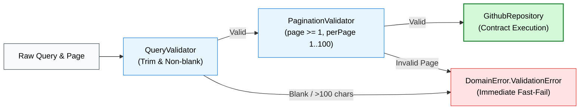

# 📦 `:core-domain`

> 📖 **Official Standards & References:**  
> • [JetBrains: Kotlin Multiplatform Pure Logic Sharing](https://kotlinlang.org/multiplatform/#choose-share-what-piece-of-logic)  
> • [Uncle Bob: The Clean Architecture](https://blog.cleancoder.com/uncle-bob/2012/08/13/the-clean-architecture.html)  
> • [Kotlin Foundation: kotlinx.serialization](https://github.com/Kotlin/kotlinx.serialization)

The pure domain and business logic core of the GitHub Core KMP SDK engine.

---

## 💡 Core Concept & Architectural Role

* **Zero Infrastructure Dependencies:** Sits at the center of the Clean Architecture graph. Has no knowledge of HTTP (Ktor), local SQLite, or UI frameworks.
* **Single Source of Truth:** Establishes platform-agnostic business models, input validations, repository contracts, and Use Cases shared across Android, iOS, and Flutter.
* **Inverted Repository Boundary:** Defines the `GithubRepository` abstraction; data layer modules (`:core-network`, `:core-cache`) implement this interface.

---

## 📦 Import & Dependencies

### Gradle
```kotlin
dependencies {
    // Consumer applications import the umbrella SDK:
    implementation("com.github.core:github-core")
    // Or internal module dependency:
    implementation(project(":core-domain"))
}
```

### Key Kotlin Imports
```kotlin
import com.github.core.domain.model.Repository
import com.github.core.domain.model.SearchResult
import com.github.core.domain.model.SortField
import com.github.core.domain.model.SortOrder
import com.github.core.domain.usecase.SearchRepositoriesUseCase
import com.github.core.domain.error.DomainError
```

---

## 🔑 Key Definitions & Domain Models

### 1. Domain Entities (`com.github.core.domain.model`)
Immutable, thread-safe data models marked `@Serializable`:

| Model | Role & Key Fields |
| :--- | :--- |
| **`Repository`** | GitHub repository entity (`id`, `name`, `fullName`, `stargazersCount`, `language`, `owner`, `htmlUrl`). |
| **`Owner`** | Repository owner (`id`, `login`, `avatarUrl`, `type`). |
| **`SearchResult<T>`** | Generic container (`totalCount: Int`, `items: List<T>`, `incompleteResults: Boolean`). |
| **`User`** | GitHub profile entity (`login`, `bio`, `publicRepos`, `followers`, `following`). |
| **`SortField` / `SortOrder`** | Enums for search ordering: `STARS`, `FORKS`, `UPDATED`, `HELP_WANTED_ISSUES` / `ASC`, `DESC`. |

### 2. Validation Rules (`com.github.core.domain.validation`)
Validates parameters prior to network dispatch to avoid wasteful latency and rate-limit hits:
* **`QueryValidator`:** Trims whitespace, rejects blank queries, and enforces `maxQueryLength = 100`.
* **`PaginationValidator`:** Enforces `page >= 1` and `perPage in 1..100`.

### 3. Domain Use Cases (`com.github.core.domain.usecase`)
Single-responsibility business operations:
* **`SearchRepositoriesUseCase`:** Coordinates `QueryValidator` and `PaginationValidator`, then delegates to `GithubRepository`.
* **`GetRepositoryDetailUseCase`:** Validates non-empty `owner` and `repo` identifiers, returning `Result<Repository>`.
* **`GetUserRepositoriesUseCase`:** Validates `username` and pagination, fetching repository listings.
* **`GetUserProfileUseCase`:** Validates `username` and retrieves user profile details.

---

## 🔬 Internal Mechanics & Validation Pipeline



### Unified Error Taxonomy (`com.github.core.domain.error.DomainError`)
All failure states are encapsulated in a sealed hierarchy extending `Exception`:
* **`ValidationError(message, field)`:** Input validation failure before network dispatch.
* **`NetworkError(message, statusCode, isRateLimit)`:** HTTP failure, connection timeout, or server error.
* **`RateLimitExceededError(resetTimeSeconds, message)`:** GitHub API quota exhausted.
* **`NotFoundError(entityName, identifier)`:** Requested entity was not found.
* **`CacheError(message, throwable)`:** Local storage read/write error.

---

## 💻 Usage Pattern

```kotlin
// Instantiate Use Case with repository implementation
val searchUseCase = SearchRepositoriesUseCase(repository = apiService)

// Execute suspending call with functional result handling
val result = searchUseCase.execute(
    query = "kotlin",
    sortField = SortField.STARS,
    sortOrder = SortOrder.DESC,
    page = 1,
    perPage = 30
)

result.onSuccess { searchResult ->
    val repositories: List<Repository> = searchResult.items
}.onFailure { error ->
    when (error) {
        is DomainError.ValidationError -> showInputError(error.message)
        is DomainError.RateLimitExceededError -> showRateLimitBanner(error.resetTimeSeconds)
        else -> showGenericError(error.message)
    }
}
```

---

## 🧪 Verification

```bash
# Run multiplatform unit tests across JVM & iOS Simulator
./gradlew :core-domain:allTests --rerun-tasks
```
