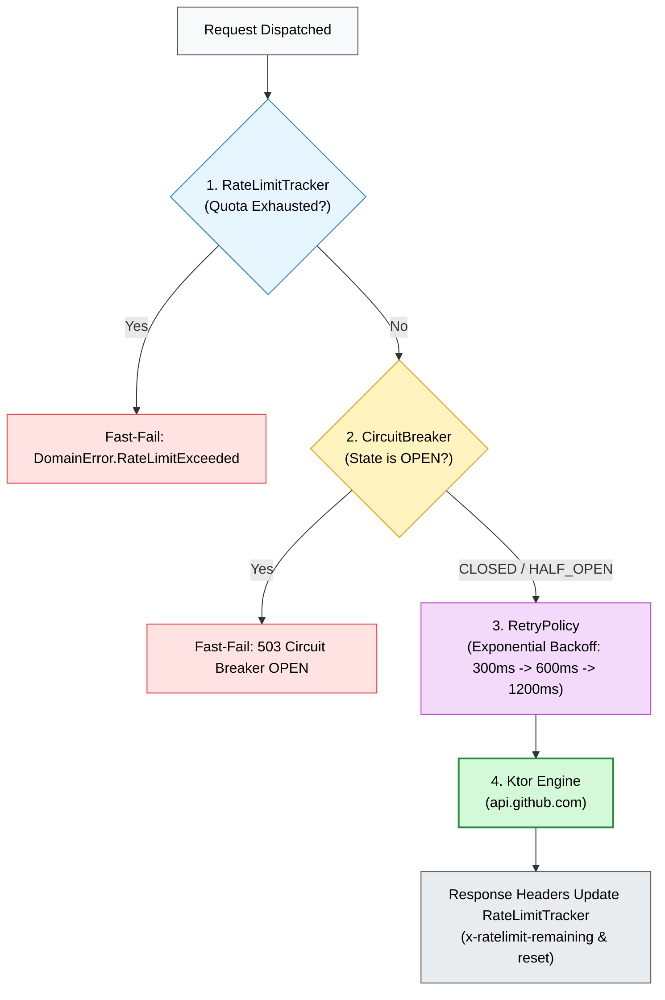

# 🌐 `:core-network`

> 📖 **Official Standards & References:**  
> • [Ktor Client: Creating a Multiplatform Application](https://ktor.io/docs/client-create-multiplatform-application.html)  
> • [Apple Developer: NSURLSession & App Transport Security](https://developer.apple.com/documentation/foundation/urlsession)  
> • [Square: OkHttp](https://square.github.io/okhttp/)  
> • [Martin Fowler: Circuit Breaker](https://martinfowler.com/bliki/CircuitBreaker.html)

Resilient multiplatform HTTP networking layer powered by Ktor Client 3.x.

---

## 💡 Core Concept & Architectural Role

* **Native Platform Engines:** Leverages native HTTP engines per platform (`OkHttp` on Android/JVM for connection pooling, `Darwin` via Apple `NSURLSession` on iOS).
* **Enterprise Resilience Triad:** Wraps every network call in **Rate Limit Tracking**, a **Circuit Breaker**, and an **Exponential Backoff Retry Policy**.
* **DTO Schema Isolation:** Isolates volatile external GitHub JSON DTOs from consumer applications by converting them into pure `:core-domain` models.

---

## 📦 Import & Dependencies

### Gradle
```kotlin
dependencies {
    // Consumer applications import the umbrella SDK:
    implementation("com.github.core:github-core")
    // Or internal module dependency:
    implementation(project(":core-network"))
}
```

### Key Kotlin Imports
```kotlin
import com.github.core.network.GithubNetworkClient
import com.github.core.network.api.GithubApiService
import com.github.core.network.resilience.CircuitBreaker
import com.github.core.network.resilience.RateLimitTracker
import com.github.core.network.resilience.RetryPolicy
```

---

## 🔑 Key Definitions & Components

| Component | Definition & Role |
| :--- | :--- |
| **`GithubNetworkClient`** | Network entrypoint; manages configured `HttpClient` and lazy `apiService`. |
| **`GithubApiService`** | Implements domain `GithubRepository` for GitHub REST routes (`search/repositories`, `repos/{owner}/{repo}`). |
| **`RateLimitTracker`** | Mutex-synchronized quota tracker parsing `x-ratelimit-*` headers to fast-fail exhausted budgets. |
| **`CircuitBreaker`** | Fail-fast state machine preventing cascading failures when the backend is degraded. |
| **`RetryPolicy`** | Exponential backoff retry engine for idempotent HTTP requests with intelligent error classification. |

---

## 🔬 Internal Mechanics: The Resilience Pipeline

Every outgoing HTTP request executes through a 3-stage resilience pipeline:



### 1. `RateLimitTracker` Internals
* Inspects `x-ratelimit-limit`, `x-ratelimit-remaining`, and `x-ratelimit-reset`.
* Fast-fails locally before dispatching to the wire if `remaining <= 0` and reset time is in the future.

### 2. `CircuitBreaker` State Machine
* **`CLOSED`:** Normal operation. Reaching `failureThreshold = 5` transitions state to `OPEN`.
* **`OPEN`:** Fast-fails requests with HTTP 503. After `resetTimeoutMs = 60s`, transitions to `HALF_OPEN`.
* **`HALF_OPEN`:** Dispatches `halfOpenSuccessThreshold = 2` canary probes. If both succeed, resets to `CLOSED`; if any fail, re-trips to `OPEN`.

### 3. `RetryPolicy` Backoff & Error Classifier
* Delays: 300ms initial delay, 2.0x multiplier, max 3000ms, up to 3 attempts.
* **Non-retriable:** Client errors `400`, `401`, `403`, `404`, and validation errors.
* **Retriable:** Server errors `500..599`, `408 Request Timeout`, `429 Too Many Requests`, and connection drops.

---

## 💻 Usage Pattern

```kotlin
// 1. Initialize client and service
val networkClient = GithubNetworkClient()
val apiService: GithubApiService = networkClient.apiService

// 2. Perform resilient API request
val result = apiService.searchRepositories(query = "compose")
result.onSuccess { searchResult ->
    println("Found ${searchResult.totalCount} repositories")
}
```

---

## 🧪 Verification

```bash
# Run offline MockEngine tests (CI safe)
./gradlew :core-network:allTests --rerun-tasks

# Run real live integration test against api.github.com
./gradlew :core-network:testAndroidHostTest --rerun-tasks
```
