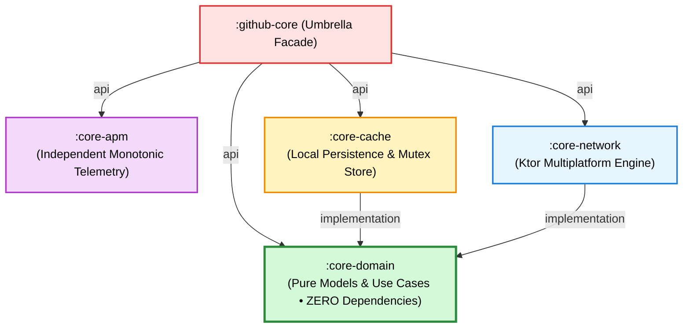

# 🌟 Reviewer & Architect Onboarding Guide (`00_START_HERE.md`)

> 📖 **Official Standards & References:**  
> • [JetBrains: Kotlin Multiplatform Architectural Paradigms](https://kotlinlang.org/multiplatform/#choose-share-what-logic-native-ui)  
> • [Uncle Bob Martin: The Clean Architecture](https://blog.cleancoder.com/uncle-bob/2012/08/13/the-clean-architecture.html)  
> • [Martin Fowler: Headless Component & Service Design](https://martinfowler.com/articles/headless-component.html)

Welcome to the **`github-core-kmp`** codebase. This guide is tailored for **lead mobile architects, engineering managers, and technical reviewers** evaluating this Kotlin Multiplatform (KMP) SDK.

---

## ⚡ 2-Minute Architectural Summary

**`github-core-kmp`** is an enterprise-grade **Headless Kotlin Multiplatform (KMP) SDK Engine**. It serves as the single source of truth for:
* **Domain Models & Validation:** Pure Kotlin models with zero Android or iOS dependencies.
* **Ktor 3.x Networking:** Platform-native engines (`OkHttp` on Android/JVM, `Darwin` on iOS).
* **Enterprise Resilience:** An internal 3-state Circuit Breaker, proactive Rate Limit tracking, and exponential backoff retry policies.
* **Offline Caching:** Coroutine `Mutex`-guarded in-memory store with TTL freshness policies and LRU eviction.
* **Observability (APM):** Allocation-free, monotonic execution timers (`TraceTimer`).

### The Headless Boundary
The SDK strictly adheres to JetBrains' official [**"One logic layer, native experience" (`logic-native-ui`)**](https://kotlinlang.org/multiplatform/#choose-share-what-logic-native-ui) paradigm:
* **The Shared Engine:** Handles the **bottom 70%** of the application stack, stopping precisely at the **Domain / Use Case layer**.
* **The Native Frontends:** **Android (Jetpack Compose)**, **iOS (SwiftUI)**, and **Flutter (Riverpod)** maintain 100% autonomy over UI rendering, lifecycle, and presentation state. No Kotlin `StateFlow` or `ViewModel` hierarchies are forced onto native clients.

---

## 🗺️ Reviewer Navigation Map

| What to Evaluate | Primary File / Directory | Key Value Rationale |
| :--- | :--- | :--- |
| **Public SDK Entrypoint** | [`github-core/src/commonMain/kotlin/com/github/core/GithubCoreSdk.kt`](../github-core/src/commonMain/kotlin/com/github/core/GithubCoreSdk.kt) | Factory pattern initializing network, caching, and services with production defaults. |
| **Resilience Triad** | [`core-network/src/commonMain/kotlin/com/github/core/network/resilience/`](../core-network/src/commonMain/kotlin/com/github/core/network/resilience/) | `CircuitBreaker.kt`, `RateLimitTracker.kt`, and `RetryPolicy.kt` preventing cascading failures. |
| **Pure Business Logic** | [`core-domain/src/commonMain/kotlin/com/github/core/domain/`](../core-domain/src/commonMain/kotlin/com/github/core/domain/) | `Repository.kt`, `QueryValidator.kt`, and `SearchRepositoriesUseCase.kt`. Zero 3rd-party deps. |
| **Thread-Safe Caching** | [`core-cache/src/commonMain/kotlin/com/github/core/cache/GithubCache.kt`](../core-cache/src/commonMain/kotlin/com/github/core/cache/GithubCache.kt) | Non-blocking coroutine `Mutex`, TTL freshness validation, and LRU eviction. |
| **APM Telemetry** | [`core-apm/src/commonMain/kotlin/com/github/core/apm/TraceTimer.kt`](../core-apm/src/commonMain/kotlin/com/github/core/apm/TraceTimer.kt) | High-precision monotonic execution timer measuring microsecond spans. |
| **Heterogeneous Integration** | [`TASK.md`](../TASK.md) & [`docs/integration/`](./integration/README.md) | Concrete consumer code for Android (Hilt), iOS (Swift `async/await`), and Flutter (Riverpod). |
| **SDK Modules Catalog** | [`docs/modules/`](./modules/README.md) | In-depth module specifications, Clean Architecture graph, and isolated test commands. |
| **Architecture Decision Records** | [`docs/adr/`](./adr/README.md) | 5 formal ADRs documenting trade-offs, alternative solutions, and consequences. |
| **Performance Benchmarks** | [`docs/benchmarks/01_sdk_performance_and_footprint.md`](./benchmarks/01_sdk_performance_and_footprint.md) | Cache latency (<1ms), cold-start timings (<4ms), and binary footprint overhead. |


---

## 🏗️ Clean Architecture Verification

The codebase strictly enforces inward dependency rules:



To verify that `:core-domain` has zero third-party dependencies, inspect [`core-domain/build.gradle.kts`](../core-domain/build.gradle.kts).

---

## 🧪 Verification & Sanity Check

Execute the following Gradle commands to verify the SDK builds cleanly and passes all test suites:

```bash
# 1. Run all tests across JVM, Android host, and iOS Simulator
./gradlew check

# 2. Run with live test logs
./gradlew check --rerun-tasks

# 3. Verify umbrella facade smoke tests
./gradlew :github-core:allTests --rerun-tasks
```

---

## 📚 Recommended Reading Order

1. [**Root README.md**](../README.md): High-level overview, architecture diagrams, and quick start.
2. [**ADR Catalog (`docs/adr/`)**](./adr/README.md): Understand the architectural decisions and trade-offs.
3. [**Client Integration Guides (`docs/integration/`)**](./integration/README.md): Learn how clients consume the SDK.
4. [**Architecture Deep Dives (`docs/architecture/`)**](./architecture/README.md): Understand the resilience state machines and memory safety.
5. [**Technical References (`docs/references.md`)**](./references.md): Platform standards, RFCs, and security compliance.
