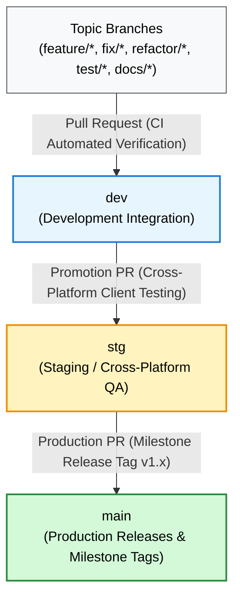

# Contributing Guidelines

**Project**: `github-core-kmp` (Headless Multiplatform Engine)  
**Author**: Dinakar Prasad Maurya  

---

## 🌿 Branch Naming Strategy

This repository follows **industry-standard semantic branch prefixes** to maintain a structured, predictable Git workflow.

### Format

```text
<type>/<descriptive-name>
```

### Branch Type Prefixes

| Prefix | Purpose | Example |
| :--- | :--- | :--- |
| **`feature/`** | New features, public SDK capabilities, or module additions | `feature/cache-freshness-policy`<br>`feature/user-repos-usecase` |
| **`fix/`** | Bug fixes, memory leak resolution, or logic corrections | `fix/darwin-tls-trust-evaluation`<br>`fix/cache-concurrency-mutex` |
| **`refactor/`** | Code structure improvements without behavioral or API changes | `refactor/extract-query-validator`<br>`refactor/network-resilience-pipeline` |
| **`test/`** | Adding, fixing, or improving multiplatform automated tests | `test/circuit-breaker-concurrency`<br>`test/search-usecase-virtual-time` |
| **`build/`** | Build system, Gradle plugins, catalog versions, compiler flags | `build/kotlin-2.0-upgrade`<br>`build/agp-library-plugin-config` |
| **`ci/`** | GitHub Actions workflows, test matrices, automation scripts | `ci/add-multiplatform-verification-matrix` |
| **`docs/`** | Documentation, architectural guides, references, diagrams | `docs/add-technical-references-catalog`<br>`docs/client-integration-guides` |
| **`perf/`** | Execution latency, allocation reduction, or APM improvements | `perf/trace-timer-monotonic-precision` |
| **`chore/`** | Housekeeping, `.gitignore` updates, release prep (no code change) | `chore/clean-obsolete-xcworkspacedata`<br>`chore/prepare-v1.0.0-release` |
| **`release/`** | Release preparation, version bumps, artifact packaging | `release/v1.0.0` |

### Branch Naming Rules

- ✅ Use lowercase letters only
- ✅ Use hyphens (`-`) to separate words (never underscores or spaces)
- ✅ Keep branch names under 50 characters
- ✅ Be descriptive and specific
- ✅ Include issue or task identifiers when applicable: `fix/issue-12-rate-limit-resource`

---

## 📝 Commit Message Convention

All commits in this repository strictly adhere to the [Conventional Commits v1.0.0](https://www.conventionalcommits.org/) specification. This provides a transparent Git history, automates changelog generation, and enforces rigorous pre-commit quality standards.

### Format Structure

```text
<type>(<optional-scope>): <short imperative summary>

[optional body explaining technical rationale, trade-offs, and motivation]

[optional footer(s): Closes #issue, BREAKING CHANGE: <description>]
```

---

### Commit Type Prefixes & Definitions

| Prefix | Name & Role | When to Use | Examples |
| :--- | :--- | :--- | :--- |
| **`feat`** | **New Feature** | Adding new SDK public APIs, domain entities, use cases, or client capabilities. | `feat(cache): implement thread-safe TTL cache with Mutex`<br>`feat(domain): add GetUserRepositoriesUseCase` |
| **`fix`** | **Bug Fix** | Resolving bugs, security vulnerabilities, race conditions, or logic defects. | `fix(network): remove insecure TLS challenge bypass in Darwin engine`<br>`fix(resilience): rethrow CancellationException in RetryPolicy` |
| **`refactor`** | **Refactoring** | Restructuring production code without altering external SDK behavior or fixing defects. | `refactor(sdk): wire use cases into GithubCoreSdk facade`<br>`refactor(domain): standardize parameter validation errors` |
| **`test`** | **Testing** | Adding or improving tests, test fakes, mock engines, or test fixtures. | `test(cache): add concurrent stress test with virtual time`<br>`test(domain): add unit tests for GetUserRepositoriesUseCase` |
| **`build`** | **Build System** | Changes affecting Gradle build scripts, `libs.versions.toml`, compiler settings, or KMP target binaries. | `build(deps): bump Ktor from 3.1.0 to 3.1.1`<br>`build(gradle): configure XCFramework export for core-apm` |
| **`ci`** | **Continuous Integration** | Changes to GitHub Actions workflows, matrix definitions, or CI verification runners. | `ci(github): add macOS runner matrix for iOS Simulator tests` |
| **`docs`** | **Documentation** | Updating documentation portals, READMEs, technical references, or KDoc comments. | `docs(references): add architecture and platform technical references`<br>`docs(samples): update iOS SwiftUI consumer guide` |
| **`perf`** | **Performance** | Code changes specifically aimed at reducing latency or memory footprint. | `perf(apm): replace date allocation with monotonic time mark` |
| **`style`** | **Code Style** | Formatting, whitespace, imports reordering, without functional code alteration. | `style(format): apply Kotlin coding conventions formatting` |
| **`chore`** | **Housekeeping** | Repository maintenance, updating `.gitignore`, license headers, or milestone prep. | `chore(repo): update gitignore for local IDE cache files` |

---

### Project Scopes

Using scopes is highly recommended to pinpoint which architectural module or subsystem was modified:

| Scope | Architectural Subsystem |
| :--- | :--- |
| `domain` | `:core-domain` (Entities, Use Cases, Validators, Error taxonomy) |
| `network` | `:core-network` (Ktor client, HTTP engines, DTOs, Mappers) |
| `resilience` | `:core-network` (CircuitBreaker, RetryPolicy, RateLimitTracker) |
| `cache` | `:core-cache` (GithubCache, storage adapters, TTL policy) |
| `apm` | `:core-apm` (TraceTimer, metric telemetry, latency spans) |
| `sdk` | `:github-core` (Umbrella SDK facade, XCFramework & AAR packaging) |
| `sample` | `sample/` consumer applications (Android Compose, iOS SwiftUI, Flutter) |
| `deps` | Dependency version catalogs (`gradle/libs.versions.toml`) |
| `ci` | Automation workflows and build pipeline scripts |

---

### 💡 Best Practices for Writing Commit Messages

1. **Use the Imperative Mood**:
   - ✅ `feat(domain): add user repository search usecase`
   - ❌ `feat(domain): added user repository search usecase`
   - ❌ `feat(domain): adds user repository search usecase`
   - *Rule*: The subject line must complete the phrase: *"If applied, this commit will..."*

2. **Follow the 50/72 Rule**:
   - Keep the summary line at or under **50 characters** (maximum 72 characters).
   - If a body is necessary, separate it with a blank line and wrap body paragraphs at **72 characters**.

3. **Atomic Commits**:
   - Each commit must represent a single cohesive unit of work.
   - Do not bundle formatting refactors (`style`), dependency bumps (`build`), and bug fixes (`fix`) in the same commit.

---

## 🔀 Branching Strategy & Promotion Pipeline

To support enterprise-grade stability, `github-core-kmp` adopts a **Multi-Environment Promotion Model**:



### Branch Hierarchy

| Branch | Environment | Purpose | Target for PRs |
| :--- | :--- | :--- | :--- |
| **`main`** | **Production** | Production-ready SDK code and verified release milestone tags (`v1.0.0`). | Only accepts PRs from `stg` |
| **`stg`** | **Staging / QA** | Pre-release validation, testing against client apps (`github-cruise-android`, `github-repo-search-ios`). | Only accepts PRs from `dev` |
| **`dev`** | **Development** | Main active integration branch. | PRs from topic branches (`feature/*`, `fix/*`, etc.) |
| **Topic Branches** | **Feature / Bugfix** | Working branches created by developers. | Branch from `dev`, merge into `dev` |

---

## 🔄 Development Step-by-Step Lifecycle

### Phase 1: Feature & Bugfix Development (Topic Branch → `dev`)

1. **Update local `dev` branch**:
   ```bash
   git checkout dev
   git pull origin dev
   ```

2. **Create topic branch from `dev`**:
   ```bash
   git checkout -b feature/offline-caching-layer
   ```

3. **Implement changes while upholding architectural rules**.

4. **Execute local verification commands**:
   ```bash
   # Run all checks across all KMP modules (Android JVM + iOS Simulator)
   ./gradlew check
   ```

5. **Commit using Conventional Commits**:
   ```bash
   git add core-cache/
   git commit -m "feat(cache): implement thread-safe cache store with Mutex"
   ```

6. **Push and create Pull Request targeting `dev`**:
   ```bash
   git push -u origin feature/offline-caching-layer
   gh pr create --base dev --title "feat(cache): implement thread-safe cache store with Mutex"
   ```

---

## 🏛️ Architecture Invariants & Engineering Guardrails

When contributing to this codebase, you must preserve the following architectural invariants:

### 1. Pure Domain Layer Boundary
- **Rule**: [`:core-domain`](file:///Users/dinakarmaurya/Documents/Personal/github-core-kmp/core-domain) must remain **100% pure Kotlin** with zero external dependencies (no Ktor, no SQLDelight, no platform APIs).
- Domain models and Use Cases must never depend on remote DTOs or storage entities.

### 2. Strict Headless Boundary
- **Rule**: Never introduce presentation state (`ViewModel`, `LiveData`, `StateFlow` presentation holders, Jetpack Compose UI, or SwiftUI views) into shared SDK modules.
- The shared KMP engine stops strictly at the **Use Case layer**. Presentation logic belongs entirely in the consumer client applications.

### 3. Structured Concurrency & Coroutine Hygiene
- **Rule**: Never swallow `CancellationException` in retry policies or error catch blocks.
- Cancellation must propagate upwards cleanly to allow client UI scopes to terminate background work immediately.

### 4. Concurrency & Multiplatform Thread Safety
- **Rule**: All shared mutable state across threads (e.g. in `GithubCache`, `CircuitBreaker`, `RateLimitTracker`) must be protected by a `kotlinx.coroutines.sync.Mutex` or thread-safe atomic collection.
- Never use unsynchronized `mutableMapOf` or mutable properties accessed across coroutine dispatchers.

### 5. Multiplatform & Swift Interoperability
- **Rule**: Public suspending Use Case functions intended for iOS consumption must provide `@Throws(Exception::class)` overloads to ensure natural Swift `async/await` `try await` bridging.

---

## 🧪 Local Verification Commands

Before opening a PR or committing code, ensure all local verification checks pass:

```bash
# 1. Run all tests and checks across all subprojects (JVM, Android, iOS Simulator)
./gradlew check

# 2. Run tests for a specific module
./gradlew :core-domain:allTests
./gradlew :core-network:allTests
./gradlew :core-cache:allTests
./gradlew :core-apm:allTests
./gradlew :github-core:allTests

# 3. Force re-run tests with standard output logging
./gradlew :github-core:allTests --rerun-tasks
```

---

## ✅ Pull Request Review Checklist

Before marking a Pull Request ready for review, verify:

- [ ] **Conventional PR Title**: Formatted as `<type>(<scope>): <description>`.
- [ ] **Compilation**: `./gradlew compileAndroidMain` and `./gradlew compileKotlinIosSimulatorArm64` succeed.
- [ ] **Tests Passing**: `./gradlew check` passes 100% with zero test failures.
- [ ] **Clean Working Tree**: No IDE files (`.idea/`, `.vscode/`), local configuration files, or temporary artifacts staged.
- [ ] **Documentation**: Any new public API or architectural decision is documented in `docs/` and referenced in `docs/references.md`.
- [ ] **No Force Pushes**: Keep Git history clean; never execute destructive force pushes (`git push --force`).

---

## 📚 Questions & Architectural References

For in-depth architectural patterns, platform guidelines, and case studies, refer to:
- 📖 [**Architecture, Platform & Technical References (`docs/references.md`)**](./references.md)
- 🌐 [**Documentation Portal (`docs/README.md`)**](./README.md)
- 📱 [**Client Applications Integration Guide (`TASK.md`)**](../TASK.md)
