# ADR 001: Headless Boundary vs. Shared ViewModels

## 📌 Status
`Accepted` (2026-09)

## 🎯 Context
Kotlin Multiplatform (KMP) allows sharing code at various layers of the stack:
1. **Full UI & Logic:** Compose Multiplatform everywhere.
2. **Presentation & Logic:** Sharing ViewModels, `StateFlow`, and UI states, keeping only widgets native.
3. **Logic Only ("Headless"):** Sharing domain models, validations, networking, and use cases, keeping presentation state and UI 100% native.

Our core SDK is intended to be adopted by multiple heterogeneous mobile clients:
- Android (Jetpack Compose, AndroidX `ViewModel`, Hilt)
- iOS (SwiftUI, `@Observable` / `@MainActor`, Swift Concurrency)
- Flutter (Flutter Widgets, Riverpod `AsyncNotifier`, Dart Event Loop)

Forcing shared Kotlin ViewModels or `StateFlow` streams onto iOS and Flutter engineers introduces friction:
- Kotlin `StateFlow` does not natively integrate with Swift's `@Observable` macro without heavy bridging code or third-party wrappers (like SKIE/KMP-NativeCoroutines).
- Coroutine lifecycle cancellation is tied to Android `viewModelScope`, whereas iOS relies on Swift `Task` hierarchies and Automatic Reference Counting (ARC).
- Forcing Kotlin presentation models on iOS and Flutter teams creates developer resistance and limits mobile platform team autonomy.

## 💡 Decision
We established a strict **Headless Boundary** implementing JetBrains' official [**"One logic layer, native experience" (`logic-native-ui`)**](https://kotlinlang.org/multiplatform/#choose-share-what-logic-native-ui) standard:
1. **The SDK stops at the Use Case layer:** `:core-domain` exposes pure suspend functions (`SearchRepositoriesUseCase.execute(query, page)`) returning standard Kotlin `Result<T>`.
2. **Zero Presentation State in Core:** No `ViewModel`, `StateFlow`, or `SharedFlow` UI states exist within `:github-core` or its child modules.
3. **Native ViewModels:**
   - Android developers wrap Use Cases in an `androidx.lifecycle.ViewModel` with Kotlin `StateFlow`.
   - iOS developers wrap Use Cases in a Swift `@MainActor @Observable` class with Swift `async/await`.
   - Flutter developers wrap Use Cases in a Riverpod `AsyncNotifier`.

```mermaid
flowchart TB
    subgraph SHARED_VM["❌ Rejected: Shared ViewModel Pattern"]
        SVM["Shared Kotlin ViewModel"] --> SFL["StateFlow Stream"]
        SFL --> BR["ObjC / Swift Bridge (SKIE)"]
        BR --> V1["iOS View (SwiftUI)"]
    end

    subgraph HEADLESS["✅ Accepted: Headless Use Case Boundary"]
        UC["Pure KMP Use Case<br/>(suspend Result&lt;T&gt;)"]
        NVM["Native Swift ViewModel<br/>(@Observable / MainActor)"]
        V2["Native SwiftUI View"]

        UC -->|"try await (Zero Leaks)"| NVM
        NVM --> V2
    end

    style SHARED_VM fill:#fff5f5,stroke:#e03131,stroke-width:1px,color:#000
    style HEADLESS fill:#f4fbf7,stroke:#2b8a3e,stroke-width:2px,color:#000
    style UC fill:#d3f9d8,stroke:#2b8a3e,stroke-width:1px,color:#000
    style NVM fill:#e7f5ff,stroke:#1c7ed6,stroke-width:1px,color:#000
    style V2 fill:#fff,stroke:#1c7ed6,stroke-width:1px,color:#000
```

## ⚖️ Consequences

### Positive
- **Zero iOS ARC Leaks:** Native Swift lifecycle eliminates retained references between Kotlin coroutine scopes and iOS view controllers.
- **Developer Enablement:** iOS and Flutter engineers write idiomatic native Swift and Dart without feeling forced into Kotlin paradigms.
- **Proven Industry Pattern:** Adopts the exact architectural boundary used by Netflix, Cash App, Duolingo, and Forbes.
- **Interoperability:** Kotlin suspend functions map cleanly to Swift `async/await` out of the box via the Kotlin/Native Objective-C export.

### Negative / Trade-offs
- Presentation state formatting (e.g. mapping `DomainError` to local UI state messages) must be authored separately in each client app.
