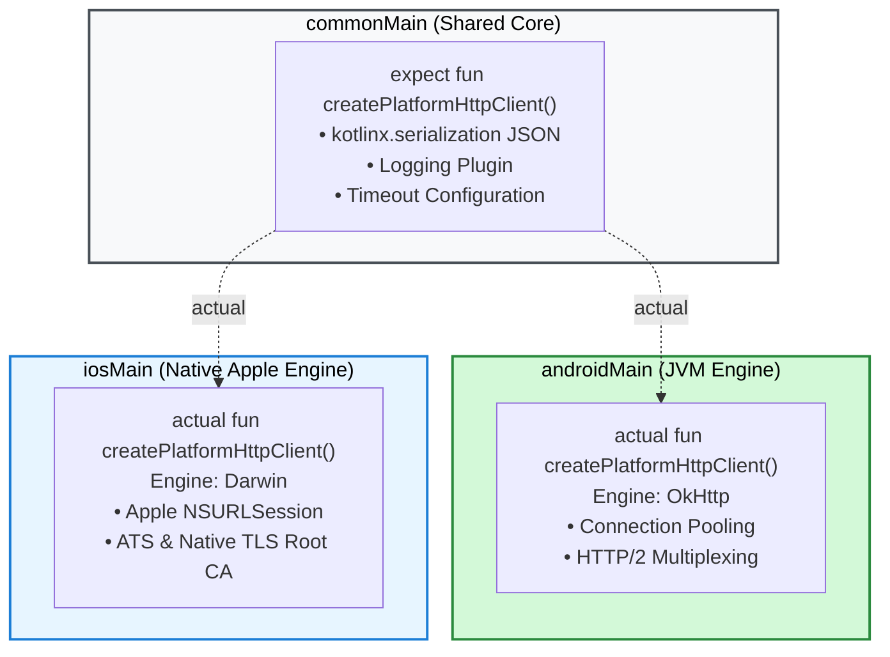

# ADR 002: Dual Platform Ktor Engines (`Darwin` & `OkHttp`)

## 📌 Status
`Accepted` (2026-09)

## 🎯 Context
Ktor 3.x Client supports multiple multiplatform HTTP engines:
- **`CIO` (Coroutine-based I/O):** Pure Kotlin engine running everywhere, but lacks native OS integration, certificate stores, and battery-saving HTTP scheduling on iOS.
- **`Curl`:** Native desktop engine requiring libcurl binaries, unsuitable for modern mobile runtimes.
- **`OkHttp`:** Android standard; highly optimized connection pooling, HTTP/2 multiplexing, and mature proxy support.
- **`Darwin` (`NSURLSession`):** Apple standard; integrates with Apple App Transport Security (ATS), cellular data constraints, background execution daemon, and native system TLS trust evaluation.

We need an HTTP stack that satisfies mobile security audits (OWASP MASVS), handles network transitions smoothly, and respects operating system energy budgets.

## 💡 Decision
We configure platform-specific HTTP engines using Kotlin `expect` / `actual` abstraction:
1. **Android / JVM (`androidMain`):** Use `io.ktor:ktor-client-okhttp`, leveraging OkHttp's mature socket pooling, TLS negotiation, and developer tooling (Network Profiler).
2. **Apple iOS (`iosMain`):** Use `io.ktor:ktor-client-darwin`, delegating transport execution directly to Apple's native `NSURLSession`.
3. **Common Layer (`commonMain`):** Configures common JSON serialization (`kotlinx.serialization`), header interceptors, and error mapping without platform dependencies.

```kotlin
// commonMain
expect fun createPlatformHttpClient(config: HttpClientConfig<*>.() -> Unit): HttpClient

// androidMain
actual fun createPlatformHttpClient(...) = HttpClient(OkHttp) { ... }

// iosMain
actual fun createPlatformHttpClient(...) = HttpClient(Darwin) { ... }
```



## ⚖️ Consequences

### Positive
- **Apple ATS Compliance:** iOS networking automatically conforms to Apple App Transport Security and system root certificate authorities without custom bypass risks.
- **Battery Optimization:** `NSURLSession` allows iOS to coalesce cellular radio wakeups and manage background network transitions efficiently.
- **Connection Multiplexing:** OkHttp on Android multiplexes HTTP/2 requests efficiently over existing sockets.

### Negative / Trade-offs
- Requires separate source sets (`androidMain` and `iosMain`) and Gradle dependencies (`ktor-client-okhttp` and `ktor-client-darwin`) rather than a single `ktor-client-cio` import.
