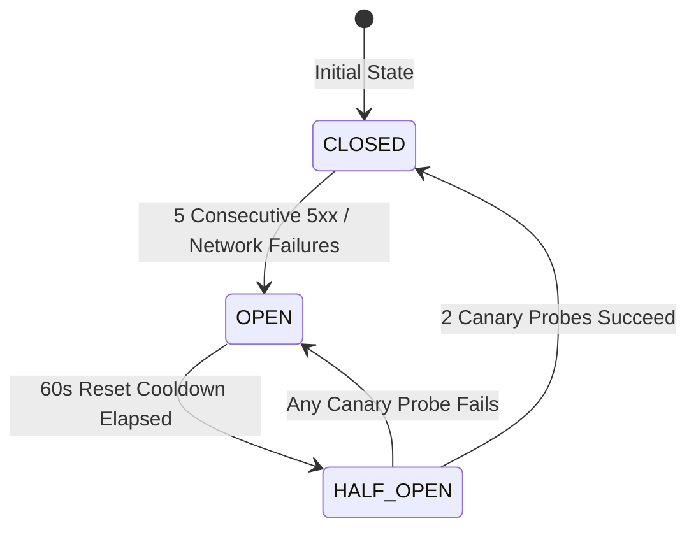

# ADR 003: In-Engine Circuit Breaker & RateLimitTracker

> 📖 **Official Standards & References:**  
> • [Martin Fowler: Circuit Breaker Pattern](https://martinfowler.com/bliki/CircuitBreaker.html)  
> • [Michael Nygard: Release It! Design and Deploy Production-Ready Software](https://pragprog.com/titles/mnee2/release-it-second-edition/)  
> • [GitHub REST API: Rate Limits](https://docs.github.com/en/rest/using-the-rest-api/rate-limits-for-the-rest-api)

## 📌 Status
`Accepted` (2026-09)

## 🎯 Context
The GitHub REST API enforces strict public rate limits:
- **Unauthenticated:** 60 requests per hour per IP.
- **Authenticated:** 5,000 requests per hour.

When an app spams repeated queries during backend outages or rate limit exhaustion, the user experiences long spinner hangs, cascading timeouts, and eventually hard HTTP 403 / 503 errors that drain device battery and crash UI state.

Furthermore, naive retry logic (e.g. retrying immediately upon 5xx or 403) exacerbates server load and triggers GitHub's secondary rate limits (anti-abuse blocks).

## 💡 Decision
We engineered an enterprise resilience triad directly into [**`:core-network`**](../../core-network/README.md):
1. **`RateLimitTracker`:**
   - Intercepts response headers (`x-ratelimit-remaining`, `x-ratelimit-reset`, `x-ratelimit-limit`).
   - If `remaining <= 0` and `resetEpochSeconds > now()`, subsequent requests are immediately rejected locally with `DomainError.RateLimitExceededError` without hitting the wire.
2. **`CircuitBreaker`:**
   - Implements Martin Fowler's 3-state state machine: `CLOSED`, `OPEN`, `HALF_OPEN`.
   - Trips to `OPEN` upon 5 consecutive server (5xx) or socket connection failures.
   - When `OPEN`, fast-fails calls with HTTP 503 for a 60-second cooldown period, preventing request storms.
   - Transitions to `HALF_OPEN` to execute 2 canary probes before safely recovering to `CLOSED`.
3. **`RetryPolicy`:**
   - Employs truncated exponential backoff (initial delay: 300ms, multiplier: 2.0x, max delay: 3,000ms, max attempts: 3).
   - Only retries idempotent operations experiencing retriable errors (`500..599`, `408`, connection drops). Rejects retries for client errors (`400`, `401`, `403`, `404`).

## ⚖️ Consequences

### Positive
- **API Quota Preservation:** Avoids burning precious GitHub API rate limits on dead requests.
- **Fail-Fast UX:** Interactive UI clients receive instantaneous error notifications (<1ms) when the circuit is open, rather than hanging on 30-second socket timeouts.
- **Cascading Failure Protection:** Shields backend services during partial outages.

### Negative / Trade-offs
- Adds a small stateful tracking layer synchronized via Kotlin Coroutines `Mutex`.
