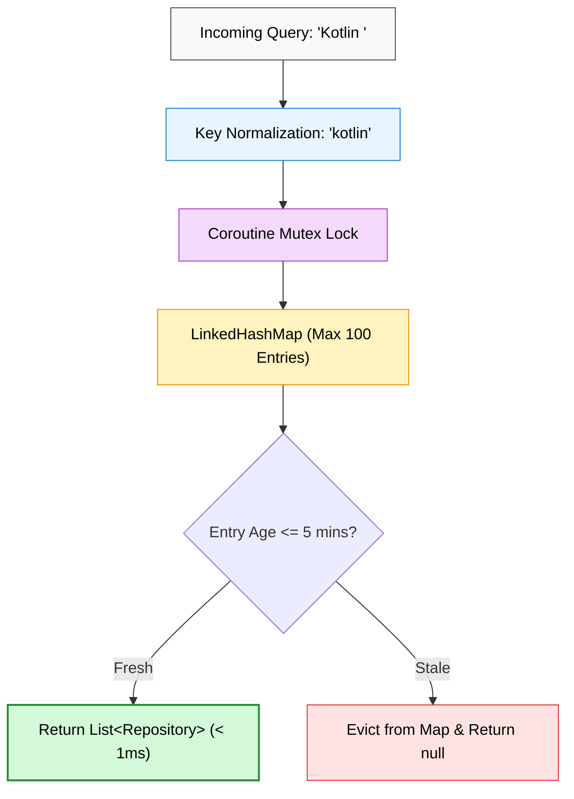

# ADR 004: Thread-Safe In-Memory TTL & LRU Caching

> 📖 **Official Standards & References:**  
> • [Kotlinx Coroutines: Mutex Synchronization](https://kotlinlang.org/api/kotlinx.coroutines/kotlinx-coroutines-core/kotlinx.coroutines.sync/-mutex/)  
> • [IETF RFC 7234: HTTP Caching Standards](https://datatracker.ietf.org/doc/html/rfc7234)

## 📌 Status
`Accepted` (2026-09)

## 🎯 Context
Mobile users frequently retype or navigate back to search queries they visited moments earlier (e.g. typing "kotlin", tapping a repo, and returning to the list).

Repeatedly executing remote HTTP calls for identical queries creates three problems:
1. Unnecessary latency (200–400ms network trip vs instant UI display).
2. Rapid consumption of the 60 requests/hour GitHub rate limit.
3. Unbounded cache memory growth if cached results are stored indefinitely in a simple `HashMap`.

While on-disk SQLite (via SQLDelight or Room) provides persistent storage across app restarts, an in-memory caching tier is required for **sub-millisecond instant UI updates** during active user sessions.

## 💡 Decision
We created [`GithubCache`](../../core-cache/src/commonMain/kotlin/com/github/core/cache/GithubCache.kt) in [**`:core-cache`**](../../core-cache/README.md):
1. **Thread Safety:** Uses Kotlin Coroutines `Mutex` to guarantee thread-safe operations across multiplatform background worker pools without blocking JVM or Apple main threads.
2. **Time-To-Live (TTL):** Default 5-minute freshness policy (`DEFAULT_TTL_MS = 300,000L`). Entries older than 5 minutes are evicted on read.
3. **Capacity Bounding (LRU):** Employs a `LinkedHashMap` bounded at 100 entries (`DEFAULT_MAX_CAPACITY = 100`). When capacity is exceeded, the oldest entry is automatically evicted before insertion.
4. **Key Normalization:** Keys are normalized (`trim().lowercase()`) so that queries like `"Kotlin "`, `"kotlin"`, and `"  KOTLIN"` hit the same cache entry.

## ⚖️ Consequences

### Positive
- **Instant Response Time:** Cache hits return in `<1ms`, providing zero-latency search feedback.
- **Defensive Memory Footprint:** Bounded at 100 entries, preventing Out-Of-Memory (OOM) errors even in long-running app sessions.
- **Network Load Reduction:** Prevents duplicate network requests during back-and-forth navigation.

### Negative / Trade-offs
- In-memory data is volatile and resets when the app process is terminated by the operating system.
