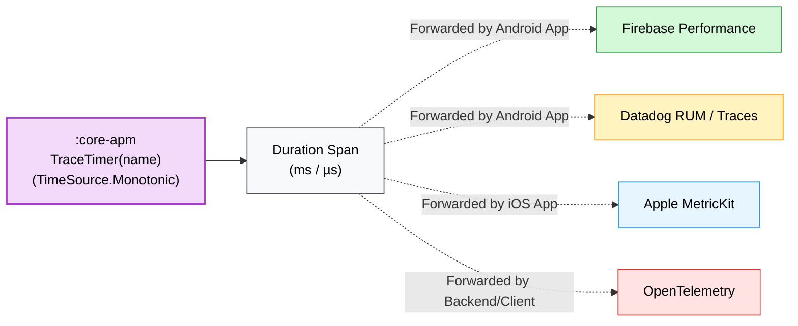

# ADR 005: Monotonic TraceTimer vs. Third-Party APM SDKs

## 📌 Status
`Accepted` (2026-09)

## 🎯 Context
Mobile teams require observability to track network latency, cache hit efficiency, and query durations in production.

However, embedding proprietary third-party APM SDKs (e.g. Firebase Performance, Datadog, Sentry, Dynatrace) directly into a core KMP shared library introduces severe drawbacks:
1. **Binary Bloat & Transitive Dependencies:** Forces heavy vendor SDKs onto all client applications regardless of their observability stack.
2. **Version Clashes:** Triggers transitive dependency conflicts with the consumer application's own version of Firebase or Datadog.
3. **Inaccurate Time Measurements:** Using `System.currentTimeMillis()` can produce negative or inflated durations if NTP clock synchronization jumps during a request.

## 💡 Decision
We created a lightweight, zero-dependency APM module [**`:core-apm`**](../../core-apm/README.md) using Kotlin's standard library `TimeSource.Monotonic`:
1. **Monotonic High Precision:** [`TraceTimer`](../../core-apm/src/commonMain/kotlin/com/github/core/apm/TraceTimer.kt) employs `TimeSource.Monotonic.markNow()` to measure elapsed time at microsecond precision, completely immune to wall-clock adjustments or daylight saving jumps.
2. **Inline Execution Helper:** Provides an allocation-free `measure(name) { ... }` inline lambda returning both the execution result and measured duration in whole milliseconds.
3. **Pluggable Telemetry:** Exposes measured duration spans to the consumer application so the client app can forward metrics to their preferred backend (Datadog, Firebase, MetricKit, or custom telemetry) without the SDK dictating the vendor.

## ⚖️ Consequences

### Positive
- **Zero Third-Party Dependencies:** Pure Kotlin standard library; zero risk of dependency version collisions.
- **Negligible Overhead:** Monotonic clock checks cost `<0.01ms` per execution span.
- **Vendor Agnostic:** Consumer applications remain free to route metrics to whichever APM or logging solution their platform standardizes on.

### Negative / Trade-offs
- The core SDK does not automatically upload spans to a remote dashboard; the consumer app must connect the measured timings to their telemetry pipeline.
