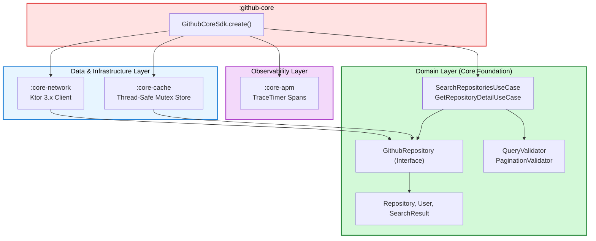

# 01. Clean Architecture & Module Boundary

> 📖 **Official Standards & References:**  
> • [Uncle Bob: The Clean Architecture](https://blog.cleancoder.com/uncle-bob/2012/08/13/the-clean-architecture.html)  
> • [JetBrains: One Logic Layer, Native Experience (logic-native-ui)](https://kotlinlang.org/multiplatform/#choose-share-what-logic-native-ui)  
> • [Martin Fowler: Inversion of Control Containers and the Dependency Injection pattern](https://martinfowler.com/articles/injection.html)

## 🏛️ Foundational Design Principles

The architecture of **`github-core-kmp`** is built on **Uncle Bob's Clean Architecture** and the **Dependency Inversion Principle (DIP)**:

1. **High-level business policies must not depend on low-level technical details.** Both must depend on abstractions.
2. **Abstractions must not depend on details.** Details (such as Ktor or SQL) must depend on abstractions (such as domain contracts).

---

## 📦 The 5 Core Modules



### 1. `:core-domain` (The Core Foundation)
- **Role:** The innermost layer containing pure business models, validation logic, and use case interactors.
- **Dependencies:** **Zero external libraries.** It does not depend on Ktor, SQLite, Android SDK, or Darwin.
- **Exports:** Domain models (`Repository`, `User`, `SearchResult`), validation rules (`QueryValidator`), errors (`DomainError`), and the repository contract (`GithubRepository`).

### 2. `:core-network` (Remote Data Infrastructure)
- **Role:** Implements the `GithubRepository` interface over the network using Ktor 3.x.
- **Dependencies:** `:core-domain`, Ktor (`ktor-client-core`, `ktor-client-content-negotiation`, `ktor-serialization-kotlinx-json`), `kotlinx-datetime`.
- **Key Feature:** Transforms network exceptions and HTTP status codes into domain-safe `DomainError` instances.

### 3. `:core-cache` (Local Data Infrastructure)
- **Role:** Implements fast, in-memory caching with TTL expiration policies and LRU eviction.
- **Dependencies:** `:core-domain`, `kotlinx-datetime`, `kotlinx-coroutines-core`.
- **Key Feature:** Thread-safe `Mutex` locking preventing race conditions across asynchronous threads.

### 4. `:core-apm` (Observability Infrastructure)
- **Role:** Multiplatform execution duration measurement for profiling network and cache operations.
- **Dependencies:** Pure Kotlin standard library (`kotlin.time.TimeSource.Monotonic`).
- **Key Feature:** Allocation-free, monotonic execution timers (`TraceTimer`).

### 5. `:github-core` (Umbrella Distribution Facade)
- **Role:** Single public entry point aggregating child modules and building distribution binaries (`.aar` and `.xcframework`).
- **Dependencies:** Uses Gradle `api(...)` declarations to transitively export all child modules into consumer classpaths.
- **Key Feature:** Factory method `GithubCoreSdk.create()` configuring the entire engine with production defaults in a single call.

---

## 🛡️ Transitive Export Pattern in `:github-core`

Consumer applications only need to declare one dependency:

```kotlin
// In consumer app build.gradle.kts
dependencies {
    implementation("com.github.core:github-core:1.0.0")
}
```

Because `github-core/build.gradle.kts` declares child modules using `api(...)`:
```kotlin
kotlin {
    sourceSets {
        commonMain.dependencies {
            api(project(":core-domain"))
            api(project(":core-network"))
            api(project(":core-cache"))
            api(project(":core-apm"))
        }
    }
}
```
All domain models, use cases, and client configurations are transitively available to the consumer without declaring 5 separate library dependencies.
