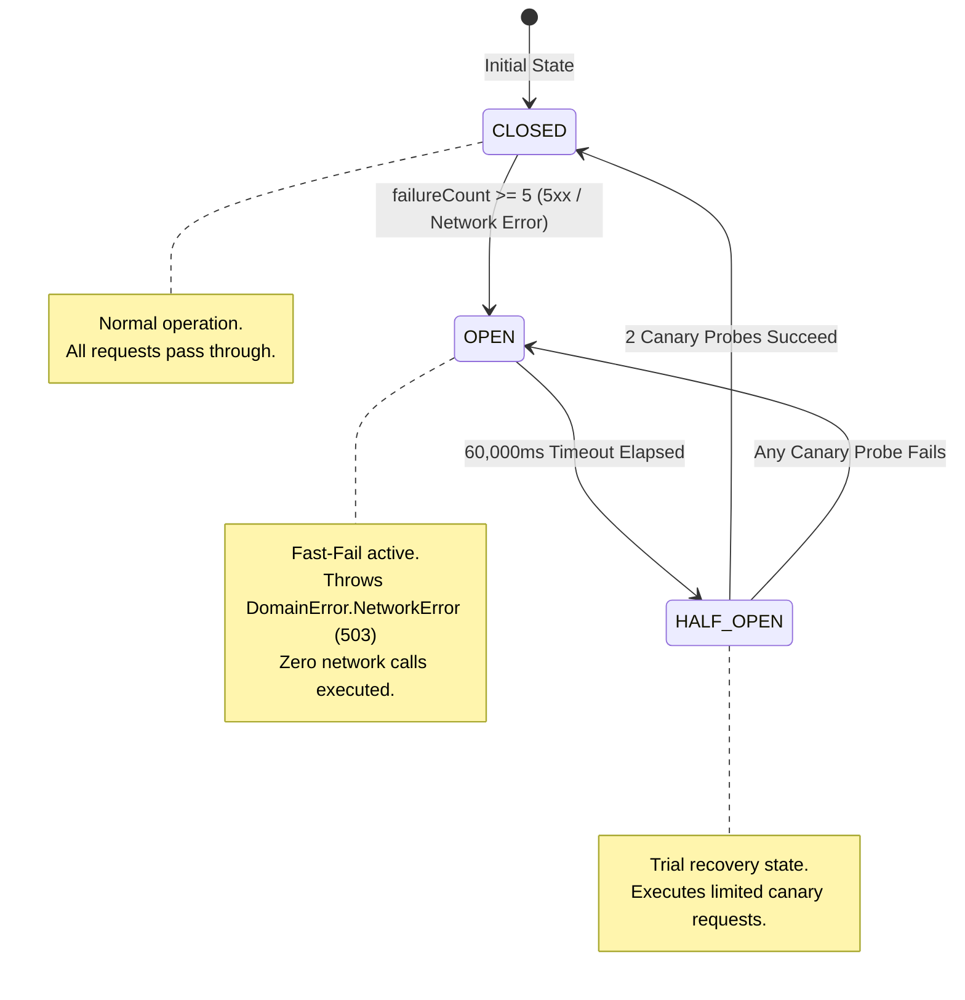

# 02. Resilience & Circuit Breaker State Machine

## 🎯 Overview

Network calls to public REST APIs are inherently prone to transient failures, degraded backend responses, and strict rate-limiting.

To ensure client applications remain responsive and never hang or crash during outages, [**`:core-network`**](../../core-network/README.md) incorporates a comprehensive resilience triad:
1. **`RateLimitTracker`**
2. **`CircuitBreaker`**
3. **`RetryPolicy`**

---

## ⚡ Circuit Breaker State Machine

The Circuit Breaker prevents the client application from repeatedly hammering a failing server.



### State Definitions

1. **`CLOSED` (Normal Operation):**
   - All requests pass through to the Ktor engine.
   - Successful requests reset `failureCount = 0`.
   - If consecutive failures reach `failureThreshold` (default: 5), the circuit trips to `OPEN`.
2. **`OPEN` (Fail-Fast):**
   - The circuit detects downstream backend degradation.
   - All incoming calls are **immediately rejected locally** with `DomainError.NetworkError(statusCode = 503)`.
   - No bytes are sent over the cellular or Wi-Fi radio.
   - After `resetTimeoutMs` (default: 60,000ms), the state automatically transitions to `HALF_OPEN`.
3. **`HALF_OPEN` (Canary Probing):**
   - Allows trial requests (canaries) to test whether the backend has recovered.
   - If `halfOpenSuccessThreshold` (default: 2) consecutive canary requests succeed, the service is deemed healthy and state resets to `CLOSED`.
   - If any canary request fails, the circuit immediately re-trips back to `OPEN` for another 60 seconds.

---

## 📊 Proactive Rate Limit Tracking (`RateLimitTracker`)

GitHub returns standard rate-limiting headers with every response:
* `x-ratelimit-limit`: Quota allowance per window (e.g. 60 or 5000).
* `x-ratelimit-remaining`: Quota remaining in current window.
* `x-ratelimit-reset`: Epoch seconds when the current window resets.

### The Problem with Passive Handling
In naive implementations, apps only discover they are rate-limited after receiving a hard `HTTP 403 Forbidden` response from the server.

### The SDK's Proactive Defense
[`RateLimitTracker`](../../core-network/src/commonMain/kotlin/com/github/core/network/resilience/RateLimitTracker.kt) maintains the latest quota state in memory:
1. Every successful or failed HTTP response updates the tracker with fresh header values.
2. Before dispatching any subsequent request, the tracker checks:
   ```kotlin
   val isExhausted = remaining <= 0 && resetEpochSeconds > Clock.System.now().epochSeconds
   ```
3. If exhausted, the SDK rejects the call locally with `DomainError.RateLimitExceededError(resetTimeSeconds)`. This prevents redundant network roundtrips and protects battery life.

---

## 🔁 Exponential Backoff & Intelligent Error Classification (`RetryPolicy`)

When a transient network error occurs, [`RetryPolicy`](../../core-network/src/commonMain/kotlin/com/github/core/network/resilience/RetryPolicy.kt) executes truncated exponential backoff:

$$\text{Delay} = \min(\text{initialDelayMs} \times (\text{multiplier})^{\text{attempt}}, \text{maxDelayMs})$$

### Default Parameters:
* Initial Delay: `300ms`
* Backoff Multiplier: `2.0x`
* Maximum Delay: `3,000ms`
* Maximum Attempts: `3`

### Error Classification Rules:
| Error Category | Examples | Retried? | Rationale |
| :--- | :--- | :---: | :--- |
| **Server Errors (5xx)** | `500 Internal Error`, `502 Bad Gateway`, `503 Service Unavailable` | **YES** | Often transient; upstream proxies or server restarts resolve within seconds. |
| **Timeouts & Disconnects** | Socket timeout, connection reset, DNS lookup drop | **YES** | Temporary radio/carrier blip. |
| **Client Errors (4xx)** | `400 Bad Request`, `401 Unauthorized`, `404 Not Found` | **NO** | Malformed query or missing entity; retrying identical requests will yield identical errors. |
| **Rate Limit (403)** | `403 Forbidden` with rate limit header | **NO** | Retrying burns secondary rate limits; must wait until reset window. |
| **Coroutines Cancellation** | `CancellationException` | **NO** | Structured concurrency signal indicating the user navigated away. Must never be swallowed. |
