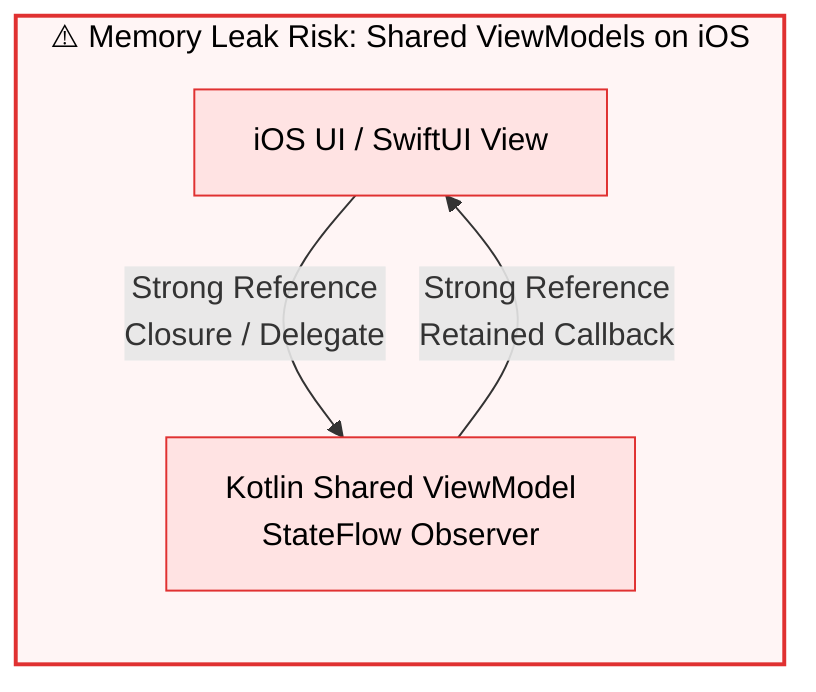

# 03. Concurrency & Memory Safety

> 📖 **Official Standards & References:**  
> • [Kotlin Coroutines: Structured Concurrency Guide](https://kotlinlang.org/docs/coroutines-basics.html#structured-concurrency)  
> • [Apple Swift: Automatic Reference Counting (ARC)](https://docs.swift.org/swift-book/documentation/the-swift-programming-language/automaticreferencecounting/)  
> • [JetBrains: Kotlin/Native Memory Management & Concurrency](https://kotlinlang.org/docs/native-memory-manager.html)

## 🎯 Overview

Kotlin Multiplatform (KMP) code runs in two distinctly different memory and threading environments:
1. **JVM / Android Runtime:** Traced garbage collection (ART/JVM) with thread pools and virtual threads.
2. **Apple iOS / Darwin Runtime:** Automatic Reference Counting (ARC) with Grand Central Dispatch (GCD) queues and Swift Concurrency event loops.

This document details how **`github-core-kmp`** maintains thread safety, prevents race conditions, and avoids retain cycles across platforms.

---

## 🔒 Mutex Synchronization in KMP

Traditional JVM synchronization primitives (e.g. `synchronized`, `ReentrantLock`) do not compile to native Apple targets and block underlying OS threads.

To provide safe, cross-platform concurrency, `github-core-kmp` exclusively uses **Kotlin Coroutines `Mutex`**:
- **Non-blocking:** A suspended coroutine waiting for a `Mutex` releases its underlying OS thread to do other work.
- **Fair Queuing:** Requests acquire the lock in FIFO order.
- **Used In:**
  - [`GithubCache`](../../core-cache/src/commonMain/kotlin/com/github/core/cache/GithubCache.kt): Guards the internal `LinkedHashMap` from concurrent read/write corruption.
  - [`CircuitBreaker`](../../core-network/src/commonMain/kotlin/com/github/core/network/resilience/CircuitBreaker.kt): Protects state transitions and canary counters.
  - [`RateLimitTracker`](../../core-network/src/commonMain/kotlin/com/github/core/network/resilience/RateLimitTracker.kt): Synchronizes rate limit status updates.

```kotlin
class GithubCache( ... ) {
    private val mutex = Mutex()
    private val memoryStore = LinkedHashMap<String, CacheEntry<List<Repository>>>()

    suspend fun save(query: String, repositories: List<Repository>) = mutex.withLock {
        // Safe, serialized write without blocking the thread
        memoryStore[key] = CacheEntry(...)
    }
}
```

---

## ⚡ Structured Concurrency & Cancellation Propagation

When a mobile user types in a search bar, previous search queries must be superseded and canceled immediately.

1. **Structured Concurrency:** All operations in the SDK are suspending functions designed to run within the caller's coroutine scope (`viewModelScope` on Android, `Task` on iOS).
2. **Cooperative Cancellation:**
   - Ktor HTTP requests support coroutine cancellation. When the consumer cancels its scope, active network sockets are closed immediately.
   - `CancellationException` is strictly preserved and **never caught by retry handlers**:
     ```kotlin
     try {
         return block()
     } catch (e: CancellationException) {
         throw e // Propagate cancellation immediately!
     } catch (e: Throwable) {
         // Handle retriable errors
     }
     ```

---

## 🍏 Apple ARC & Objective-C Export Safety

When Kotlin code is compiled into `GithubCoreKMP.xcframework`, Kotlin/Native generates Objective-C class wrappers that integrate with Swift ARC.

### Why ViewModels Are Kept Native
If a shared Kotlin class holds a strong reference to an iOS UI closure or callback, or if Swift delegates hold strong references to Kotlin long-running coroutines, an ARC circular retain cycle can occur:



```mermaid
flowchart LR
    subgraph SAFE["✅ Headless KMP Architecture: Zero Retained Leaks"]
        IOS_VM["iOS Native ViewModel<br/>(@Observable / @MainActor)"]
        KMP_UC["KMP Use Case<br/>(Stateless Interactor)"]

        IOS_VM -->|try await execute()<br/>Transient Call| KMP_UC
        KMP_UC -.->|Returns Result&lt;T&gt;<br/>Zero Retained Reference| IOS_VM
    end

    style SAFE fill:#f4fbf7,stroke:#2b8a3e,stroke-width:2px,color:#000
    style IOS_VM fill:#d3f9d8,stroke:#2b8a3e,stroke-width:1px,color:#000
    style KMP_UC fill:#e7f5ff,stroke:#1c7ed6,stroke-width:1px,color:#000
```

Because **`github-core-kmp`** strictly stops at the **Use Case layer** (ADR 001):
1. Use Cases are **stateless interactors**: they take inputs, execute a suspending query, return a value, and finish.
2. No long-lived closures or listeners are retained inside the shared engine.
3. Swift ViewModels retain the Use Case, call it asynchronously via `try await useCase.execute(...)`, and retain zero Kotlin references once the task completes.
4. Memory leaks on iOS are mathematically eliminated at the architectural boundary.
