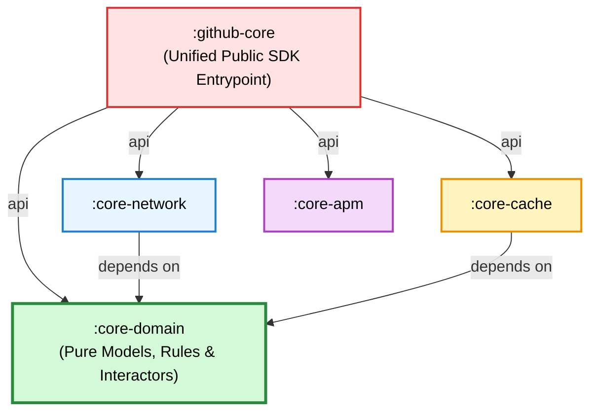

# 🏗️ Architecture Deep-Dive Portal

This section provides technical documentation for the internal design, concurrency patterns, and resilience mechanisms of **`github-core-kmp`**.

---

## 📚 Architectural Guides

| Document | Topic | Key Concepts |
| :--- | :--- | :--- |
| [**01. Clean Architecture & Module Boundary**](./01_clean_architecture_and_boundary.md) | Structural hierarchy & facade design | Inward dependency rule, Use Cases, transitive `api(...)` exports, public SDK surface. |
| [**02. Resilience & Circuit Breaker State Machine**](./02_resilience_and_circuit_breaker.md) | Fault tolerance & rate limit protection | 3-state state machine (`CLOSED` ➔ `OPEN` ➔ `HALF_OPEN`), Canary probes, `RateLimitTracker`, exponential backoff. |
| [**03. Concurrency & Memory Safety**](./03_concurrency_and_memory_safety.md) | Non-blocking execution & native interop | Structured concurrency, coroutine cancellation, Mutex synchronization, Apple ARC safety. |

---

## 🧭 Dependency Inversion & Strict Boundary Rules

1. **Rule 1 (Inward Flow):** Dependencies strictly point towards `:core-domain`. `:core-domain` has **zero external dependencies** and never imports networking or storage libraries.
2. **Rule 2 (No UI in Core):** The SDK stops at the Use Case layer. No UI widgets, Composable functions, or AndroidX `ViewModel` hierarchies exist inside the core engine.
3. **Rule 3 (Thread Safety):** All shared state is protected by non-blocking Kotlin Coroutine `Mutex` locks to guarantee safety across JVM thread pools and Apple dispatch queues.
