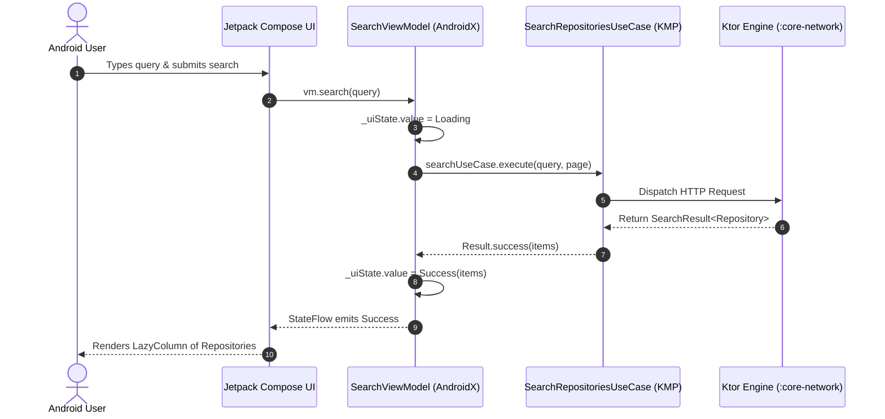

# 01. Android Jetpack Compose Integration Guide

> 📖 **Official Standards & References:**  
> • [Android Developers: Guide to App Architecture](https://developer.android.com/topic/architecture)  
> • [Android Developers: Jetpack Compose Documentation](https://developer.android.com/develop/ui/compose)  
> • [Google: Dependency Injection with Dagger Hilt](https://developer.android.com/training/dependency-injection/hilt-android)  
> • [JetBrains: Kotlin StateFlow in Android](https://developer.android.com/kotlin/flow/stateflow-and-sharedflow)

## 🎯 Overview
This guide demonstrates how an Android application consumes **`github-core-kmp`** using **Jetpack Compose**, **AndroidX ViewModel**, and **Dagger Hilt**.



---

## 1. Dependency Setup

In the Android application module's `build.gradle.kts`:

```kotlin
dependencies {
    // Import the compiled KMP SDK engine
    implementation("com.github.core:github-core:1.0.0")

    // AndroidX & Compose
    implementation("androidx.lifecycle:lifecycle-viewmodel-ktx:2.8.7")
    implementation("androidx.lifecycle:lifecycle-runtime-compose:2.8.7")
    implementation(platform("androidx.compose:compose-bom:2024.11.00"))
    implementation("androidx.compose.material3:material3")
}
```

---

## 2. Dependency Injection (Hilt)

Provide the SDK instance and Use Cases via a Hilt `@Module`:

```kotlin
package com.github.cruise.di

import com.github.core.GithubCoreSdk
import com.github.core.domain.usecase.SearchRepositoriesUseCase
import dagger.Module
import dagger.Provides
import dagger.hilt.InstallIn
import dagger.hilt.components.SingletonComponent
import javax.inject.Singleton

@Module
@InstallIn(SingletonComponent::class)
object CoreSdkModule {

    @Provides
    @Singleton
    fun provideGithubCoreSdk(): GithubCoreSdk = GithubCoreSdk.create()

    @Provides
    @Singleton
    fun provideSearchRepositoriesUseCase(sdk: GithubCoreSdk): SearchRepositoriesUseCase =
        SearchRepositoriesUseCase(sdk.networkClient.apiService)
}
```

---

## 3. Presentation State & ViewModel (UDF)

```kotlin
package com.github.cruise.presentation.search

import androidx.lifecycle.ViewModel
import androidx.lifecycle.viewModelScope
import com.github.core.domain.error.DomainError
import com.github.core.domain.model.Repository
import com.github.core.domain.usecase.SearchRepositoriesUseCase
import dagger.hilt.android.lifecycle.HiltViewModel
import kotlinx.coroutines.flow.MutableStateFlow
import kotlinx.coroutines.flow.StateFlow
import kotlinx.coroutines.flow.asStateFlow
import kotlinx.coroutines.launch
import javax.inject.Inject

sealed interface SearchUiState {
    object Idle : SearchUiState
    object Loading : SearchUiState
    data class Success(val repositories: List<Repository>) : SearchUiState
    data class Error(val message: String) : SearchUiState
}

@HiltViewModel
class SearchViewModel @Inject constructor(
    private val searchUseCase: SearchRepositoriesUseCase
) : ViewModel() {

    private val _uiState = MutableStateFlow<SearchUiState>(SearchUiState.Idle)
    val uiState: StateFlow<SearchUiState> = _uiState.asStateFlow()

    fun search(query: String) {
        viewModelScope.launch {
            _uiState.value = SearchUiState.Loading
            searchUseCase.execute(query = query, page = 1)
                .onSuccess { result ->
                    _uiState.value = SearchUiState.Success(result.items)
                }
                .onFailure { error ->
                    val message = when (error) {
                        is DomainError.ValidationError -> error.message
                        is DomainError.RateLimitExceededError -> "Rate limit reached. Reset in ${error.resetTimeSeconds}s"
                        else -> error.message ?: "An unexpected error occurred"
                    }
                    _uiState.value = SearchUiState.Error(message)
                }
        }
    }
}
```

---

## 4. Compose UI Binding

```kotlin
@Composable
fun SearchScreen(
    viewModel: SearchViewModel = hiltViewModel()
) {
    val uiState by viewModel.uiState.collectAsStateWithLifecycle()

    Column(modifier = Modifier.fillMaxSize().padding(16.dp)) {
        SearchBar(onSearch = { query -> viewModel.search(query) })

        when (val state = uiState) {
            is SearchUiState.Idle -> Text("Enter a search term")
            is SearchUiState.Loading -> CircularProgressIndicator()
            is SearchUiState.Success -> LazyColumn {
                items(state.repositories) { repo -> RepositoryItem(repo) }
            }
            is SearchUiState.Error -> Text(text = state.message, color = MaterialTheme.colorScheme.error)
        }
    }
}
```
