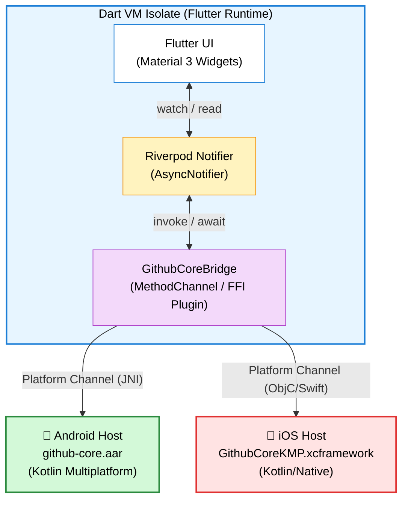

# 03. Flutter Riverpod Integration Guide

## 🎯 Overview
This guide demonstrates how a cross-platform **Flutter** application consumes **`github-core-kmp`** using a platform bridge and **Riverpod `AsyncNotifier`**.

---

## 1. Architectural Bridge Concept

Flutter code executes inside a separate Dart VM isolate. The compiled KMP SDK engine (`github-core.aar` on Android and `GithubCoreKMP.xcframework` on iOS) is called through a Flutter platform plugin via **`MethodChannel`** or **Dart FFI**.



---

## 2. Riverpod State Management (`AsyncNotifier`)

```dart
import 'package:flutter_riverpod/flutter_riverpod.dart';
import 'package:github_core_bridge/github_core_bridge.dart';
import 'package:github_core_bridge/models/repository.dart';

final searchRepositoriesProvider =
    AsyncNotifierProvider<SearchNotifier, List<Repository>>(SearchNotifier.new);

class SearchNotifier extends AsyncNotifier<List<Repository>> {
  @override
  Future<List<Repository>> build() async {
    // Initial idle state: empty list
    return [];
  }

  Future<void> search(String query) async {
    if (query.trim().isEmpty) return;

    state = const AsyncValue.loading();
    state = await AsyncValue.guard(() async {
      // Delegates to KMP shared engine via platform bridge
      final result = await GithubCoreBridge.searchRepositories(
        query: query,
        page: 1,
      );
      return result.items;
    });
  }
}
```

---

## 3. Flutter UI Binding

```dart
import 'package:flutter/material.dart';
import 'package:flutter_riverpod/flutter_riverpod.dart';

class SearchScreen extends ConsumerWidget {
  const SearchScreen({super.key});

  @override
  Widget build(BuildContext context, WidgetRef ref) {
    final searchState = ref.watch(searchRepositoriesProvider);

    return Scaffold(
      appBar: AppBar(title: const Text('GitHub Search')),
      body: searchState.when(
        data: (repositories) => ListView.builder(
          itemCount: repositories.length,
          itemBuilder: (context, index) {
            final repo = repositories[index];
            return ListTile(
              title: Text(repo.fullName),
              subtitle: Text(repo.description ?? ''),
              trailing: Text('⭐ ${repo.stargazersCount}'),
            );
          },
        ),
        loading: () => const Center(child: CircularProgressIndicator()),
        error: (err, stack) => Center(child: Text('Error: $err')),
      ),
    );
  }
}
```
