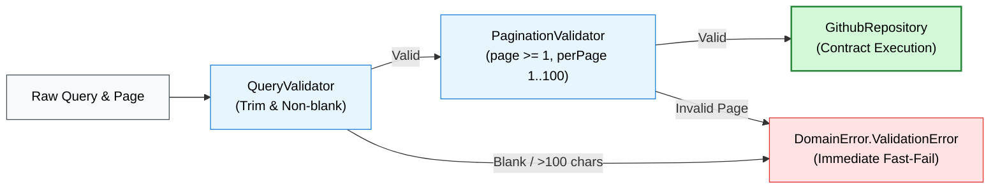

# Module Spec: `:core-domain`

> 📖 **Official Standards & References:**  
> • [JetBrains: Introduce Kotlin Multiplatform to Your Project](https://kotlinlang.org/docs/multiplatform-introduce-your-project.html)  
> • [Kotlin Foundation: kotlinx.serialization Standard](https://github.com/Kotlin/kotlinx.serialization)  
> • [Uncle Bob: Clean Architecture - Entities & Use Cases](https://blog.cleancoder.com/uncle-bob/2012/08/13/the-clean-architecture.html)

## 💡 Architectural Role & Concept
* **Zero Infrastructure Dependencies:** Sits at the innermost center of Clean Architecture. Has no knowledge of HTTP (Ktor), SQLite, or UI frameworks.
* **Single Source of Truth:** Establishes platform-agnostic business models, input validations, repository contracts, and Use Cases shared across Android, iOS, and Flutter.
* **Inverted Repository Boundary:** Defines the `GithubRepository` abstraction; data layer modules (`:core-network`, `:core-cache`) implement this interface.

---

## 🔑 Key Components

### 1. Domain Entities (`com.github.core.domain.model`)
Immutable, thread-safe data models marked `@Serializable`:
* **`Repository`**: GitHub repository entity (`id`, `name`, `fullName`, `stargazersCount`, `language`, `owner`, `htmlUrl`).
* **`Owner`**: Repository owner (`id`, `login`, `avatarUrl`, `type`).
* **`SearchResult<T>`**: Generic container (`totalCount: Int`, `items: List<T>`, `incompleteResults: Boolean`).
* **`User`**: GitHub profile entity (`login`, `bio`, `publicRepos`, `followers`, `following`).
* **`SortField` / `SortOrder`**: Enums for search ordering: `STARS`, `FORKS`, `UPDATED`, `HELP_WANTED_ISSUES` / `ASC`, `DESC`.

### 2. Validation Rules (`com.github.core.domain.validation`)
Validates parameters prior to network dispatch to avoid wasteful latency and rate-limit hits:
* **`QueryValidator`**: Trims whitespace, rejects blank queries, and enforces `maxQueryLength = 100`.
* **`PaginationValidator`**: Enforces `page >= 1` and `perPage in 1..100`.



### 3. Domain Use Cases (`com.github.core.domain.usecase`)
Single-responsibility business interactors:
* **`SearchRepositoriesUseCase`**: Coordinates `QueryValidator` and `PaginationValidator`, then delegates to `GithubRepository`.
* **`GetRepositoryDetailUseCase`**: Validates non-empty `owner` and `repo` identifiers, returning `Result<Repository>`.
* **`GetUserRepositoriesUseCase`**: Validates `username` and pagination, fetching repository listings.
* **`GetUserProfileUseCase`**: Validates `username` and retrieves user profile details.

### 4. Unified Error Taxonomy (`com.github.core.domain.error.DomainError`)
Sealed hierarchy extending `Exception`:
* **`ValidationError(message, field)`**: Input validation failure before network dispatch.
* **`NetworkError(message, statusCode, isRateLimit)`**: HTTP failure, connection timeout, or server error.
* **`RateLimitExceededError(resetTimeSeconds, message)`**: GitHub API quota exhausted.
* **`NotFoundError(entityName, identifier)`**: Requested entity was not found.
* **`CacheError(message, throwable)`**: Local storage read/write error.

---

## 💻 Kotlin Usage Pattern

```kotlin
// Instantiate Use Case with repository implementation
val searchUseCase = SearchRepositoriesUseCase(repository = apiService)

// Execute suspending call with functional result handling
val result = searchUseCase.execute(
    query = "kotlin",
    sortField = SortField.STARS,
    sortOrder = SortOrder.DESC,
    page = 1,
    perPage = 30
)

result.onSuccess { searchResult ->
    val repositories: List<Repository> = searchResult.items
}.onFailure { error ->
    when (error) {
        is DomainError.ValidationError -> showInputError(error.message)
        is DomainError.RateLimitExceededError -> showRateLimitBanner(error.resetTimeSeconds)
        else -> showGenericError(error.message)
    }
}
```

---

## 🧪 Testing Strategy
- Unit tests execute in `commonTest` without Android or iOS emulators.
- Validates boundary conditions: blank query strings, character limits, zero/negative page indexes, and pagination boundaries.
- Execution speed: **< 100ms** across 30+ tests.
