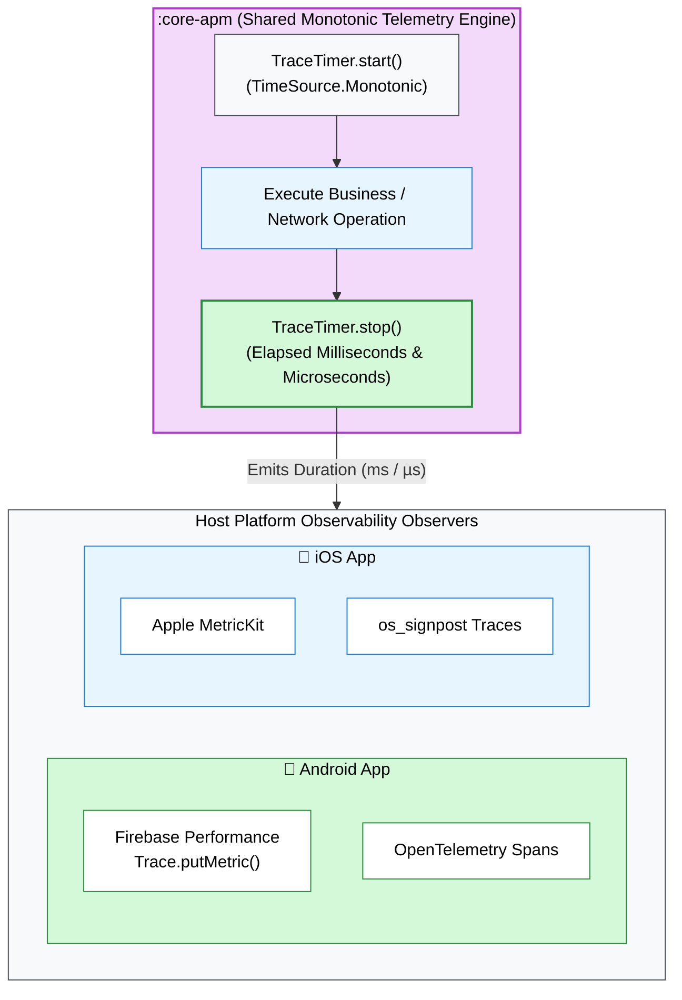

# Module Spec: `:core-apm`

## 💡 Architectural Role & Concept
* **Execution Latency Observability:** Accurately measures operation durations for network queries, cache lookups, and Use Case processing.
* **Vendor-Agnostic Design:** Does not package proprietary vendor SDKs (Firebase/Datadog) into the shared KMP binary, preventing binary bloat and version conflicts.
* **Zero Overhead:** Employs allocation-free, non-blocking monotonic timers executing in $\mathcal{O}(1)$ time with negligible CPU footprint (<0.01ms per span).

---

## 🔑 Key Definitions: `TraceTimer`

`TraceTimer` (`com.github.core.apm`) tracks operation latency across platforms:

| Property / Method | Definition & Role |
| :--- | :--- |
| `val name: String` | Span identifier (e.g. `"github_search_request"`). |
| `fun start(): TraceTimer` | Captures starting monotonic timestamp. |
| `fun stop(): Long` | Captures terminal timestamp, computes $\Delta t = t_{\text{end}} - t_{\text{start}}$, and returns duration in milliseconds. |
| `var durationMs: Long` | Recorded execution duration in milliseconds. |
| `var durationMicroseconds: Long` | Recorded execution duration in microseconds. |
| `companion inline fun measure(...)` | Inline utility executing a code block and returning `Pair<Result, Long>`. |

---

## 🔬 Platform Bridging Architecture



Host applications capture durations emitted by `TraceTimer` and forward them to native APM tools:
* **Android:** Bridges into `Firebase.performance.newTrace(timer.name).putMetric(...)`.
* **iOS:** Bridges into Apple `os_signpost` or MetricKit payloads.

---

## 💻 Kotlin Usage Pattern

```kotlin
// 1. Start execution timer
val timer = TraceTimer("repo_search_span").start()

// 2. Perform operation
val result = searchUseCase.execute("kotlin")

// 3. Stop timer and forward duration
val elapsedMs = timer.stop()
println("Search operation completed in ${elapsedMs}ms (${timer.durationMicroseconds}µs)")

// Or using the inline measurement helper:
val (searchResult, duration) = TraceTimer.measure("inline_span") {
    searchUseCase.execute("compose")
}
```

---

## 🧪 Testing Strategy
* Asserts non-negative duration calculations across consecutive calls.
* Verifies microsecond precision tracking.
* Confirms zero heap allocations in `measure { ... }`.
