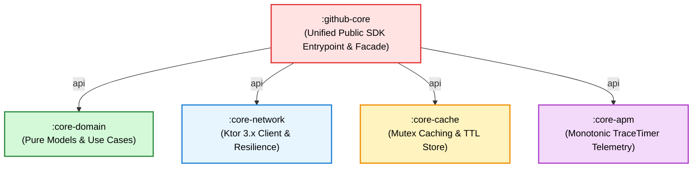

# Module Spec: `:github-core`

> 📖 **Official Standards & References:**  
> • [Apple Developer: Creating a Multi-Platform XCFramework](https://developer.apple.com/documentation/xcode/creating-a-multi-platform-xcframework)  
> • [Android Developers: Create an Android Library (AAR)](https://developer.android.com/studio/projects/android-library)  
> • [JetBrains: Multiplatform Gradle Plugin - Transitive Dependencies & API Export](https://kotlinlang.org/docs/multiplatform-add-dependencies.html#api-dependencies)

## 💡 Architectural Role & Concept
* **Public SDK Facade:** Combines `:core-domain`, `:core-network`, `:core-cache`, and `:core-apm` into a cohesive, single-entrypoint SDK.
* **Single Dependency:** Consumer apps declare one dependency (`"com.github.core:github-core"`) and automatically receive all public domain models, Use Cases, and network services.
* **Unified Factory:** Provides `GithubCoreSdk.create()` to wire network, caching, and services with sensible production defaults.

---

## 🔑 Key Definitions: `GithubCoreSdk`

| Member | Definition & Role |
| :--- | :--- |
| `companion fun create(): GithubCoreSdk` | Factory initializing the SDK instance with default network client and cache. |
| `val networkClient: GithubNetworkClient` | Access to Ktor HTTP client and `apiService`. |
| `val cache: GithubCache` | Access to local caching store. |

---

## 🔬 Transitive Assembly Graph



Using Gradle `api(...)` declarations in `github-core/build.gradle.kts`, child modules are transitively exported into the consumer application's compilation classpath.

### Multiplatform Distribution Targets
* **🤖 Android:** Packaged as an Android AAR library via Android Gradle Plugin (`com.android.library`).
* **🍏 iOS:** Compiled into `GithubCoreKMP.xcframework` / static framework via Kotlin/Native for Swift Package Manager (SPM) or CocoaPods.
* **📱 Flutter:** Consumed via Platform Channels (`MethodChannel`) or Dart FFI.

---

## 💻 Usage Patterns

### Android (Kotlin)
```kotlin
val sdk = GithubCoreSdk.create()
val searchUseCase = SearchRepositoriesUseCase(sdk.networkClient.apiService)
```

### iOS (Swift via SPM / Framework)
```swift
import GithubCoreKMP

let sdk = GithubCoreSdk.companion.create()
let searchUseCase = SearchRepositoriesUseCase(repository: sdk.networkClient.apiService)
```

---

## 🧪 Verification
```bash
# Run end-to-end SDK smoke tests
./gradlew :github-core:allTests --rerun-tasks
```
