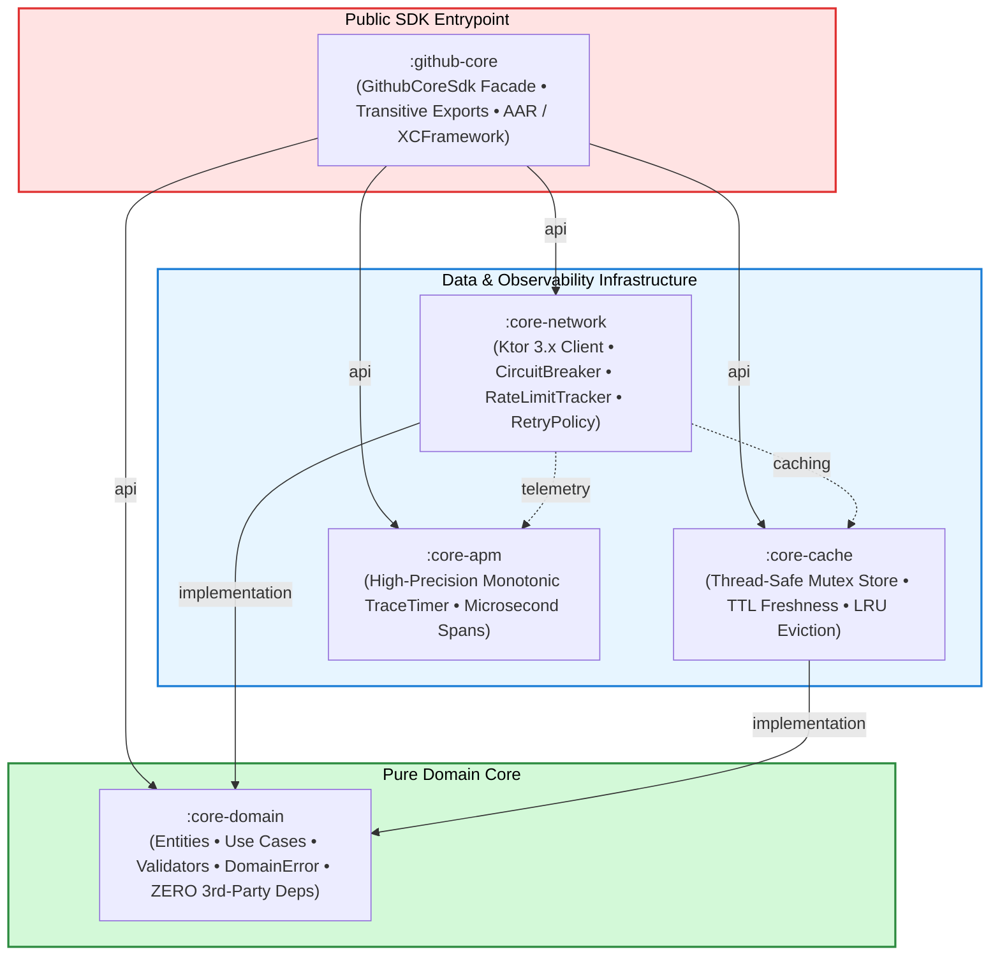

# 📦 SDK Modules Catalog & Component Responsibilities

> 📖 **Official Standards & References:**  
> • [JetBrains: Kotlin Multiplatform Project Structure](https://kotlinlang.org/docs/multiplatform-discover-project.html)  
> • [Uncle Bob: The Clean Architecture](https://blog.cleancoder.com/uncle-bob/2012/08/13/the-clean-architecture.html)

This directory contains in-depth documentation for all five Kotlin Multiplatform (KMP) modules composing the **`github-core-kmp`** headless SDK engine.

---

## 🗺️ Module Dependency & Data Flow Graph



---

## 📋 Module Summary Catalog

| Module | Architectural Role | Key Responsibilities | Dependencies | Detailed Guide |
| :--- | :--- | :--- | :--- | :--- |
| **`:core-domain`** | **Pure Business Core** | Immutable models (`Repository`, `User`), input validators (`QueryValidator`), Use Cases (`SearchRepositoriesUseCase`), and error taxonomy (`DomainError`). | **None** (Pure Kotlin) | [**Read Spec**](./01_core_domain.md) |
| **`:core-network`** | **Remote Data & Resilience** | Ktor 3.x multiplatform client (`OkHttp` on Android, `Darwin` on iOS), 3-state `CircuitBreaker`, `RateLimitTracker`, exponential backoff `RetryPolicy`, DTO mapping. | `:core-domain`, Ktor 3.x, `kotlinx-datetime` | [**Read Spec**](./02_core_network.md) |
| **`:core-cache`** | **In-Memory Persistence** | Thread-safe coroutine `Mutex` cache store, 5-minute TTL freshness validation, 100-item LRU capacity bounds, and query normalization. | `:core-domain`, Coroutines, `kotlinx-datetime` | [**Read Spec**](./03_core_cache.md) |
| **`:core-apm`** | **Observability Telemetry** | High-precision `TraceTimer` using monotonic system clocks, microsecond duration tracking, and vendor-agnostic span emission. | Pure Kotlin (`kotlin.time.TimeSource`) | [**Read Spec**](./04_core_apm.md) |
| **`:github-core`** | **Umbrella SDK Facade** | Single-entrypoint factory `GithubCoreSdk.create()`, transitive Gradle `api(...)` aggregation, and artifact packaging (`.aar` and `.xcframework`). | Aggregates all child modules | [**Read Spec**](./05_github_core.md) |

---

## 🧪 Isolated Module Verification Commands

Thanks to Clean Architecture isolation, any module can be built and tested independently:

```bash
# 1. Pure Domain Logic Tests (< 100ms)
./gradlew :core-domain:allTests --rerun-tasks

# 2. Network Client, MockEngine & CircuitBreaker Tests
./gradlew :core-network:allTests --rerun-tasks

# 3. Cache Mutex & LRU Concurrency Tests
./gradlew :core-cache:allTests --rerun-tasks

# 4. APM Monotonic Timer Tests
./gradlew :core-apm:allTests --rerun-tasks

# 5. Umbrella Facade End-to-End Smoke Tests
./gradlew :github-core:allTests --rerun-tasks
```
